# Tutorial: AisleAide

**AisleAide** is a mobile application designed to help users navigate grocery stores and manage their shopping.
It uses *indoor positioning* with beacons to determine the user's location on a *store map grid* and provides *pathfinding* to product locations.
Users can interact using a *voice assistant*, scan products with *image recognition*, manage their shopping *cart*, and view purchase *history* stored in a *database*.
Secure *user authentication* ensures personalized data and access.


## Visual Overview

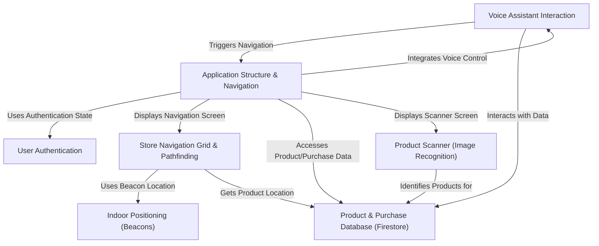

## Chapters

1. [Application Structure & Navigation
](01_application_structure___navigation_.md)
2. [User Authentication
](02_user_authentication_.md)
3. [Store Navigation Grid & Pathfinding
](03_store_navigation_grid___pathfinding_.md)
4. [Indoor Positioning (Beacons)
](04_indoor_positioning__beacons__.md)
5. [Product & Purchase Database (Firestore)
](05_product___purchase_database__firestore__.md)
6. [Product Scanner (Image Recognition)
](06_product_scanner__image_recognition__.md)
7. [Voice Assistant Interaction
](07_voice_assistant_interaction_.md)

---

# Chapter 1: Application Structure & Navigation

Welcome to the AisleAide tutorial! In this first chapter, we'll explore the basic blueprint of our application – how it's organized and how you, as a user, can move around within it. Think of it like understanding the layout of a building before you start exploring its rooms.

Every app needs a starting point and a way to navigate between its main sections. For AisleAide, this is crucial because it has different features like finding products, scanning items, and managing your shopping list. Without a clear structure and easy navigation, it would be confusing to use!

Our central idea for navigation is a handy **Bottom Navigation Bar**. This bar sits at the bottom of the screen and acts like a control panel, allowing you to instantly jump to the main parts of the app.

Let's imagine you just opened the AisleAide app. What happens first? You see the main screen, and at the bottom, you see a bar with different icons. Tapping these icons takes you to different places in the app without losing your place or getting lost. This bottom bar is our primary way of navigating between the main sections.

## The App's Blueprint: Key Concepts

To understand how this works, let's look at the main parts:

1.  **The Starting Point:** Where the app begins its journey.
2.  **The Navigation Hub:** The central component that holds everything together and manages switching between the main screens.
3.  **The Main Screens:** The individual sections of the app you can visit (Home, Navigation, Product Scan, Cart, Profile).

Let's dive into how these pieces fit together in the code.

## How AisleAide Starts

Every Flutter app starts with a `main` function. This is the very first piece of code that runs.

Look at the `main.dart` file:

```dart
// --- File: aisleaide/lib/main.dart ---
import 'package:aisleaide/Firebase_and_beacons/login.dart';
import 'package:aisleaide/Voice_assistant_and_database/home_screen.dart';
// ... other imports
import 'package:aisleaide/mynavigation_bar.dart'; // Import our navigation bar
import 'package:firebase_auth/firebase_auth.dart';
import 'package:firebase_core/firebase_core.dart';
import 'package:flutter/material.dart';

void main() async {
  WidgetsFlutterBinding.ensureInitialized();
  await Firebase.initializeApp(
    options: DefaultFirebaseOptions.currentPlatform,
  );

  // Check if the user is already logged in
  User? user = FirebaseAuth.instance.currentUser;

  runApp(MyApp(user)); // Starts the app by running the MyApp widget
}

class MyApp extends StatelessWidget {
  final User? user;

  const MyApp(this.user, {super.key});

  @override
  Widget build(BuildContext context) {
    return MaterialApp(
      debugShowCheckedModeBanner: false,
      // ... routes defined
      home: StreamBuilder<User?>( // This widget listens for authentication changes
        stream: FirebaseAuth.instance.authStateChanges(),
        builder: (context, snapshot) {
          if (snapshot.connectionState == ConnectionState.waiting) {
            return const CircularProgressIndicator(); // Show loading while checking login
          } else if (snapshot.hasData || user != null) {
            // If user is authenticated, show the HomeScreen with navigation bar
            return const MyNavigationBar(); // THIS is our navigation hub!
          } else {
            // If user is not authenticated, show the Login screen
            return const Login();
          }
        },
      ),
    );
  }
}
```

*   The `main()` function is the app's entry gate. It does some initial setup (like connecting to Firebase, which we'll talk about in [User Authentication](02_user_authentication_.md) and later chapters).
*   Crucially, `runApp(MyApp(user));` tells Flutter to display the `MyApp` widget.
*   `MyApp` decides what the *very first* screen you see will be. It checks if you are already logged in.
*   If you are logged in, it shows `MyNavigationBar()`. If not, it shows the `Login()` screen (which is covered in [User Authentication](02_user_authentication_.md)).
*   So, `MyNavigationBar` is what you see most of the time when you are using the app after logging in.

## The Navigation Hub: MyNavigationBar

The `MyNavigationBar` widget is where the magic of our main navigation happens. It's a `StatefulWidget`, which means it can remember and change its state – specifically, which tab you currently have selected.

Let's look at the `mynavigation_bar.dart` file:

```dart
// --- File: aisleaide/lib/mynavigation_bar.dart ---
import 'package:aisleaide/Voice_assistant_and_database/camera_screen.dart';
import 'package:aisleaide/Voice_assistant_and_database/cart_screen.dart';
// ... other screen imports
import 'package:aisleaide/Voice_assistant_and_database/home_screen.dart';
import 'package:aisleaide/Voice_assistant_and_database/navigation_screen.dart';
import 'package:aisleaide/Voice_assistant_and_database/profile_screen.dart';
// ... other imports
import 'package:flutter/material.dart';

class MyNavigationBar extends StatefulWidget {
  const MyNavigationBar({super.key});

  @override
  MyNavigationBarState createState() => MyNavigationBarState();
}

class MyNavigationBarState extends State<MyNavigationBar> {
  int _currentIndex = 0; // Keeps track of the currently selected tab index (0 = first tab)

  final List<Widget> _children = const [ // A list of the main screens
    HomeScreen(),
    NavigationScreen(),
    CameraScreen(),
    CartScreen(),
    ProfileScreen(),
    // Note: CreateProductListScreen and SearchProductsScreen are also listed here
    // but not shown in the bottom bar. They are accessed differently.
    // We'll focus on the ones in the bottom bar for now.
    // CreateProductListScreen(),
    // SearchProductsScreen(),
  ];

  @override
  Widget build(BuildContext context) {
    return Scaffold( // Scaffold provides the basic app layout structure
      body: _children[_currentIndex], // The main area shows the screen based on the index
      bottomNavigationBar: Container( // Container for styling the bottom bar
        decoration: BoxDecoration(
           // ... box shadow styling
        ),
        child: BottomNavigationBar( // The actual bottom navigation bar widget
          currentIndex: _currentIndex, // Tell the bar which tab is selected
          onTap: onTabTapped, // What to do when a tab is tapped
          // ... styling properties (colors, size, etc.)
          items: const [ // The list of tabs (icons and labels)
            BottomNavigationBarItem(icon: ImageIcon(AssetImage('assets/home.png')), label: 'Home'),
            BottomNavigationBarItem(icon: ImageIcon(AssetImage('assets/marker.png')), label: 'Navigation'),
            BottomNavigationBarItem(icon: ImageIcon(AssetImage('assets/camera.png')), label: 'Product Scan'),
            BottomNavigationBarItem(icon: ImageIcon(AssetImage('assets/shopping-cart.png')), label: 'Cart'),
            BottomNavigationBarItem(icon: ImageIcon(AssetImage('assets/user.png')), label: 'Profile'),
          ],
        ),
      ),
    );
  }

  void onTabTapped(int index) {
    setState(() { // Tell Flutter to rebuild the widget
      _currentIndex = index; // Update the selected index
    });
  }
}
```

*   `MyNavigationBarState` holds the state, specifically `_currentIndex`. This integer tells us which tab is currently active (0 for the first tab, 1 for the second, and so on).
*   `_children` is a list containing the widgets (screens) that each tab corresponds to. `HomeScreen` is at index 0, `NavigationScreen` is at index 1, and so on.
*   The `build` method uses a `Scaffold`. A `Scaffold` is a basic visual structure for a Material Design app, providing placeholders for an app bar, body, and bottom navigation bar.
*   `body: _children[_currentIndex]` is the key part! It tells the `Scaffold` to display the widget from the `_children` list that matches the current `_currentIndex`. If `_currentIndex` is 0, it shows the `HomeScreen`. If it's 1, it shows the `NavigationScreen`, and so on.
*   `bottomNavigationBar: BottomNavigationBar(...)` creates the visual bar at the bottom.
*   `items` defines the icons and labels for each tab in the bar. Each `BottomNavigationBarItem` corresponds to one screen in the `_children` list (in the same order).
*   `onTap: onTabTapped` tells the bar to call the `onTabTapped` function whenever a tab is tapped.
*   The `onTabTapped` function simply updates the `_currentIndex` variable to the index of the tapped tab and calls `setState`. `setState` is important because it tells Flutter that the state has changed and the widget needs to be rebuilt (re-run its `build` method) to show the correct screen.

## How Navigation Works (Step-by-Step)

Let's trace what happens when you open the app and tap a tab:

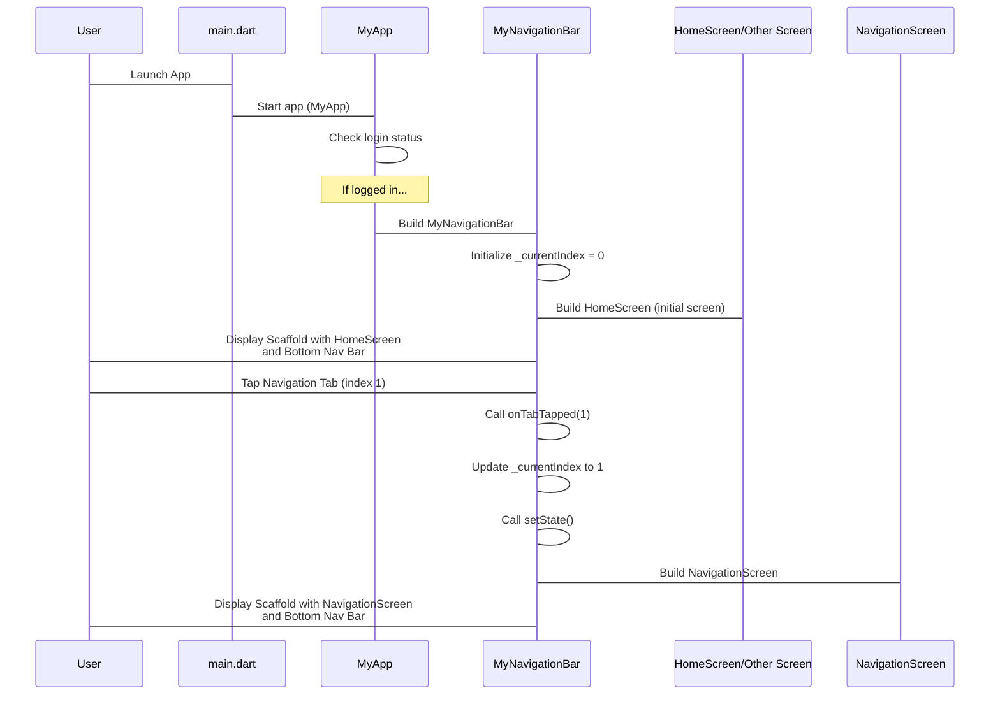

This diagram shows the flow:
1.  The user launches the app, triggering the `main` function.
2.  `main` starts `MyApp`.
3.  `MyApp` checks if the user is logged in. If yes, it builds `MyNavigationBar`.
4.  `MyNavigationBar` starts with the `HomeScreen` displayed (`_currentIndex` is 0).
5.  The user sees the `HomeScreen` and the bottom bar.
6.  When the user taps a different tab (like Navigation, index 1), the `onTabTapped` function is called.
7.  `_currentIndex` is updated, and `setState` makes Flutter rebuild `MyNavigationBar`.
8.  In the rebuild, the `body` now displays the screen at the *new* index (`NavigationScreen`).

This pattern keeps the bottom navigation bar visible while only swapping out the main content area (`body`) of the `Scaffold`.

## Summary

In this chapter, we learned about the basic structure of the AisleAide app:

| Component         | Role                                                | Code Location           |
| :---------------- | :-------------------------------------------------- | :---------------------- |
| `main` function   | The entry point of the app.                         | `lib/main.dart`         |
| `MyApp` widget    | Sets up the app, determines the initial screen.     | `lib/main.dart`         |
| `MyNavigationBar` | The main navigation hub, manages the bottom bar and screen switching. | `lib/mynavigation_bar.dart` |
| Main Screens      | Individual sections like Home, Navigation, etc.     | `lib/Voice_assistant_and_database/*.dart` (e.g., `home_screen.dart`) |
| Bottom Navigation Bar | Visual element at the bottom to switch screens. | Inside `MyNavigationBar` |

We saw how `main` starts `MyApp`, which then displays `MyNavigationBar` (if logged in). `MyNavigationBar` uses a list of screens and an index to show the correct screen in its body when you tap an item in the `BottomNavigationBar`.

Now that you understand how the app is structured and how to navigate its main sections, the next logical step is to understand how we know *who* is using the app – **User Authentication**.

[Next Chapter: User Authentication](02_user_authentication_.md)

---

<sub><sup>Generated by [AI Codebase Knowledge Builder](https://github.com/The-Pocket/Tutorial-Codebase-Knowledge).</sup></sub> <sub><sup>**References**: [[1]](https://github.com/Sehandu-Siriwardhana/AisleAide/blob/54a750566e84fa8dc4d576bf67f02843332dd958/aisleaide/lib/Voice_assistant_and_database/camera_screen.dart), [[2]](https://github.com/Sehandu-Siriwardhana/AisleAide/blob/54a750566e84fa8dc4d576bf67f02843332dd958/aisleaide/lib/Voice_assistant_and_database/cart_screen.dart), [[3]](https://github.com/Sehandu-Siriwardhana/AisleAide/blob/54a750566e84fa8dc4d576bf67f02843332dd958/aisleaide/lib/Voice_assistant_and_database/home_screen.dart), [[4]](https://github.com/Sehandu-Siriwardhana/AisleAide/blob/54a750566e84fa8dc4d576bf67f02843332dd958/aisleaide/lib/Voice_assistant_and_database/navigation_screen.dart), [[5]](https://github.com/Sehandu-Siriwardhana/AisleAide/blob/54a750566e84fa8dc4d576bf67f02843332dd958/aisleaide/lib/Voice_assistant_and_database/profile_screen.dart), [[6]](https://github.com/Sehandu-Siriwardhana/AisleAide/blob/54a750566e84fa8dc4d576bf67f02843332dd958/aisleaide/lib/main.dart), [[7]](https://github.com/Sehandu-Siriwardhana/AisleAide/blob/54a750566e84fa8dc4d576bf67f02843332dd958/aisleaide/lib/mynavigation_bar.dart)</sup></sub>

# Chapter 2: User Authentication

Welcome back to the AisleAide tutorial! In the [previous chapter](01_application_structure___navigation_.md), we learned about the basic structure of our app and how you can move between its main sections using the bottom navigation bar. We saw that right after starting, the app checks if you are logged in.

But how does the app know *who* you are? And what does it mean to be "logged in"? That's exactly what this chapter is all about: **User Authentication**.

Think of AisleAide like a store with special perks for registered customers (like keeping track of your shopping list or purchase history). When you enter the store, the "User Authentication" system is like the friendly security guard at the entrance who checks your ID. This guard makes sure you are who you say you are before you can start shopping and access your personalized benefits.

In AisleAide, our "ID" is your **Google account**, and the "security guard" is powered by **Firebase Authentication**.

## What is User Authentication?

At its core, authentication is just verifying someone's identity.

*   **In the real world:** Showing your driver's license to prove you can drive.
*   **In AisleAide:** Using your Google account to prove it's *you* using the app, not someone else.

By authenticating you, the app can:

1.  **Personalize your experience:** Show your past shopping lists, remember your preferences.
2.  **Secure your data:** Ensure only you can see your information.
3.  **Link data to you:** Any items you scan or add to your cart can be associated with your account for later.

## Why Google Sign-In?

Instead of making you create a brand new username and password just for AisleAide (and having another password to remember!), we use Google Sign-In.

*   **Convenience:** You probably already have a Google account (like a Gmail address).
*   **Speed:** It's usually much faster than filling out long registration forms.
*   **Security:** Google handles the complex parts of keeping your login information secure.

Firebase Authentication makes it easy for app developers to add Google Sign-In (and other login methods) to their apps without building the entire system from scratch.

## The Login Screen

As we saw in `main.dart` in the last chapter, if you are not logged in when you open the app, you are shown the `Login` screen.

Let's look at a simplified version of the `Login` screen code (`lib/Firebase_and_beacons/login.dart`):

```dart
// --- Simplified Snippet from lib/Firebase_and_beacons/login.dart ---
import 'package:aisleaide/Firebase_and_beacons/fire_function.dart'; // Import our login logic

class Login extends StatefulWidget {
  const Login({super.key});

  @override
  State<Login> createState() => _LoginState();
}

class _LoginState extends State<Login> {
  final FirebaseService _firebaseService = FirebaseService(); // Our helper for Firebase tasks

  @override
  Widget build(BuildContext context) {
    return Scaffold(
      // ... lots of UI code for background, animation, text ...
      body: Center(
        child: Column(
          mainAxisAlignment: MainAxisAlignment.center,
          children: [
            // ... Lottie animation, Welcome text ...
            ElevatedButton( // The button the user taps
              onPressed: () async { // What happens when button is tapped
                await _firebaseService.signInWithGoogle(); // Call the sign-in function
                // App listens for the login change and navigates automatically (via main.dart StreamBuilder)
              },
              // ... button styling, icon, text ...
              child: const Row(
                mainAxisSize: MainAxisSize.min,
                children: [
                  // ... Google icon ...
                  SizedBox(width: 10),
                  Text("Login with Google", style: TextStyle(fontSize: 18)),
                ],
              ),
            ),
            // ... other UI elements ...
          ],
        ),
      ),
    );
  }
  // ... _buildBackgroundCircles method ...
}
```

This screen is quite visual, but the core piece for authentication is the `ElevatedButton` with the text "Login with Google". When you tap this button, the `onPressed` function is triggered.

Inside `onPressed`, we call `_firebaseService.signInWithGoogle()`. This is where the actual login process starts.

## How "Login with Google" Works

The `signInWithGoogle()` function is located in our `FirebaseService` helper class (`lib/Firebase_and_beacons/fire_function.dart`). This class contains methods for interacting with Firebase Authentication.

Let's look at the key parts of the `signInWithGoogle()` method:

```dart
// --- Simplified Snippet from lib/Firebase_and_beacons/fire_function.dart ---
import 'package:firebase_auth/firebase_auth.dart'; // Firebase Auth package
import 'package:google_sign_in/google_sign_in.dart'; // Google Sign-In package

class FirebaseService {
  final FirebaseAuth _auth = FirebaseAuth.instance; // Firebase Auth instance
  final GoogleSignIn _googleSignIn = GoogleSignIn(); // Google Sign-In instance

  Future<String?> signInWithGoogle() async {
    try {
      // Step 1: Start the Google Sign-In flow
      final GoogleSignInAccount? googleSignInAccount =
          await _googleSignIn.signIn();

      if (googleSignInAccount != null) {
        // Step 2: Get authentication details from the signed-in Google account
        final GoogleSignInAuthentication googleSignInAuthentication =
            await googleSignInAccount.authentication;

        // Step 3: Create a Firebase credential using Google's tokens
        final AuthCredential credential = GoogleAuthProvider.credential(
          accessToken: googleSignInAuthentication.accessToken,
          idToken: googleSignInAuthentication.idToken,
        );

        // Step 4: Sign in to Firebase using the Google credential
        await _auth.signInWithCredential(credential);

        // Step 5: Check if a user is now logged in via Firebase
        if (_auth.currentUser != null) {
          return _auth.currentUser!.displayName; // Return the user's name
        } else {
          // This case is unlikely if signInWithCredential succeeded
          return null;
        }
      } else {
        // User cancelled the Google Sign-In process
        return null;
      }
    } catch (e) {
      // Handle any errors during the process
      print('Error during Google Sign-In: $e'); // Log error
      return null;
    }
  }

  // ... other methods like signOutFromGoogle, deleteAccount ...
}
```

Let's break down what happens when you tap "Login with Google":

1.  **`await _googleSignIn.signIn();`**: The app asks the Google Sign-In library to start the process. This usually pops up a consent screen asking you to choose your Google account and approve sharing information with AisleAide.
2.  **Get Google Info**: If you approve, Google gives the app details about your account, including special `accessToken` and `idToken` values. These tokens prove you successfully logged in with Google.
3.  **Create Firebase `AuthCredential`**: We use the tokens from Google to create a `AuthCredential` object. This is like packaging Google's proof into a format Firebase understands.
4.  **`await _auth.signInWithCredential(credential);`**: We tell Firebase Authentication to sign in the user using the Google proof we just created. Firebase verifies these tokens with Google, finds or creates a corresponding user account in Firebase, and logs that user into the Firebase Authentication system.
5.  **Firebase Confirms Login**: Once Firebase successfully signs in the user, it updates its status.

## How the App Knows You're Logged In (Back to `main.dart`)

Remember in [Chapter 1](01_application_structure___navigation_.md) we looked at `main.dart` and how `MyApp` decides what screen to show using a `StreamBuilder`? This is where Firebase's update comes into play.

Let's revisit the crucial part of `MyApp`:

```dart
// --- Snippet from lib/main.dart ---
class MyApp extends StatelessWidget {
  final User? user; // Initial user check result

  const MyApp(this.user, {super.key});

  @override
  Widget build(BuildContext context) {
    return MaterialApp(
      // ... routes ...
      home: StreamBuilder<User?>( // LISTENS for authentication changes!
        stream: FirebaseAuth.instance.authStateChanges(), // The stream to listen to
        builder: (context, snapshot) {
          if (snapshot.connectionState == ConnectionState.waiting) {
            // Still checking the initial state
            return const CircularProgressIndicator(); // Show loading
          } else if (snapshot.hasData || user != null) {
            // User is logged in (either initially or the stream updated)
            return const MyNavigationBar(); // Go to the main app navigation
          } else {
            // User is NOT logged in
            return const Login(); // Show the Login screen
          }
        },
      ),
    );
  }
}
```

The `FirebaseAuth.instance.authStateChanges()` is a "stream". Think of a stream like a river that sends out notifications whenever something interesting happens (in this case, the user's login status changes).

*   When the app first starts, this stream might send a value indicating if a user was already logged in from a previous session (`snapshot.hasData`).
*   Crucially, *after* you successfully tap "Login with Google" and `_auth.signInWithCredential` finishes, Firebase sends a *new* notification through this stream indicating that a `User` is now logged in!
*   The `StreamBuilder` is constantly watching this river. When it sees a new notification (a `User` object instead of `null`), it automatically rebuilds its widget tree.
*   In the `builder` function, `snapshot.hasData` becomes `true`.
*   Because `snapshot.hasData` is true, the `StreamBuilder` now decides to show `const MyNavigationBar()` instead of `const Login()`.

This is a super elegant way to handle navigation based on login state! You don't need manual navigation calls (`Navigator.push`) after login in this setup; the UI simply reacts to the authentication state change.

## Logging Out

Logging out is just the reverse process. On the `ProfileScreen` (`lib/Voice_assistant_and_database/profile_screen.dart`), there's a "Logout" button.

```dart
// --- Simplified Snippet from lib/Voice_assistant_and_database/profile_screen.dart ---
import 'package:aisleaide/Firebase_and_beacons/fire_function.dart'; // Import FirebaseService

class ProfileScreen extends StatefulWidget {
  const ProfileScreen({super.key});
  // ...
}

class _ProfileScreenState extends State<ProfileScreen> {
  // ... other state variables and methods ...

  Future<void> _signOut() async {
    try {
      // Use the signOutFromGoogle method from our FirebaseService
      await FirebaseService().signOutFromGoogle();
    } catch (error) {
      // Handle errors
      print("Error signing out: $error");
      // Show error message
    }
  }

  Future<void> _confirmLogout() async {
    // Show a confirmation dialog before logging out
    return showDialog(
      context: context,
      builder: (BuildContext context) {
        return AlertDialog(
          title: const Text("Logout Confirmation"),
          content: const Text("Are you sure you want to logout?"),
          actions: [
            TextButton(
              onPressed: () {
                Navigator.of(context).pop(); // Close the dialog
              },
              child: const Text("No"),
            ),
            TextButton(
              onPressed: () async {
                await _signOut(); // Call the sign out function
                Navigator.of(context).pop(); // Close the dialog
                // The StreamBuilder in main.dart will handle navigation back to Login
              },
              child: const Text("Yes"),
            ),
          ],
        );
      },
    );
  }

  @override
  Widget build(BuildContext context) {
    return Scaffold(
      // ... UI for profile picture, name, etc. ...
      body: Center(
        child: Column(
          mainAxisAlignment: MainAxisAlignment.start,
          children: [
            // ... profile info ...
            ElevatedButton(
              onPressed: _confirmLogout, // Calls the confirmation dialog
              // ... styling ...
              child: const SizedBox(
                width: 300,
                child: Row(
                  mainAxisAlignment: MainAxisAlignment.start,
                  children: [
                    Icon(Icons.logout_sharp, size: 20),
                    SizedBox(width: 8),
                    Text('Logout', style: TextStyle(fontSize: 18)),
                  ],
                ),
              ),
            ),
            // ... Delete Account button ...
          ],
        ),
      ),
      // ... Floating action button ...
    );
  }
  // ... navigation helper methods ...
}
```

When you tap "Logout", a confirmation dialog pops up (`_confirmLogout`). If you tap "Yes", the `_signOut()` function is called.

The `_signOut()` function calls `FirebaseService().signOutFromGoogle()`.

Let's look at that method in `FirebaseService`:

```dart
// --- Snippet from lib/Firebase_and_beacons/fire_function.dart ---
// ... imports and class definition ...

  Future<void> signOutFromGoogle() async {
    // Sign out from Google (revokes Google session)
    await _googleSignIn.signOut();
    // Sign out from Firebase (clears Firebase user session)
    await _auth.signOut();
  }

  // ... signInWithGoogle and deleteAccount methods ...
}
```

1.  **`await _googleSignIn.signOut();`**: This tells the Google Sign-In library to end the current Google session for your app.
2.  **`await _auth.signOut();`**: This tells Firebase Authentication to sign out the current user.

Just like with login, when `_auth.signOut()` finishes, the `FirebaseAuth.instance.authStateChanges()` stream sends out a new notification, this time indicating that there is *no* user (`null`). The `StreamBuilder` in `main.dart` sees this, and because `snapshot.hasData` is now false, it rebuilds the UI to show the `Login` screen again.

## Login/Logout Flow Diagram

Here's a simple diagram showing the main steps:

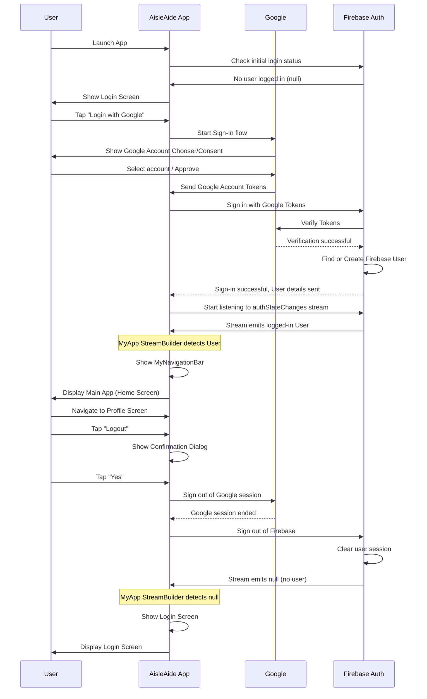

This diagram illustrates how the different parts (your tap, the app code, Google, and Firebase) work together to handle the login and logout processes. The key takeaway is that the `StreamBuilder` in `main.dart` automatically switches the main screen displayed based on the user's authentication status reported by Firebase.

## Summary

In this chapter, we explored User Authentication in AisleAide:

*   It's like the store's security guard, verifying who you are.
*   We use Google Sign-In for ease of use and security.
*   Firebase Authentication manages the user accounts and the connection with Google.
*   When you tap "Login with Google", the app works with Google and Firebase to sign you in using tokens.
*   The app stays updated on your login status by listening to the `FirebaseAuth.instance.authStateChanges()` stream in `main.dart`.
*   Based on the stream, the app automatically shows either the `Login` screen or the main navigation (`MyNavigationBar`).
*   Logging out involves signing out of both Firebase and Google sessions, which again updates the stream and changes the screen back to `Login`.

Now that we know how to manage who is using the app, we can start exploring the app's main features. One of the core features is helping you find your way around a store, which involves understanding the store's layout.

[Next Chapter: Store Navigation Grid & Pathfinding](03_store_navigation_grid___pathfinding_.md)

---

<sub><sup>Generated by [AI Codebase Knowledge Builder](https://github.com/The-Pocket/Tutorial-Codebase-Knowledge).</sup></sub> <sub><sup>**References**: [[1]](https://github.com/Sehandu-Siriwardhana/AisleAide/blob/54a750566e84fa8dc4d576bf67f02843332dd958/aisleaide/lib/Firebase_and_beacons/fire_function.dart), [[2]](https://github.com/Sehandu-Siriwardhana/AisleAide/blob/54a750566e84fa8dc4d576bf67f02843332dd958/aisleaide/lib/Firebase_and_beacons/login.dart), [[3]](https://github.com/Sehandu-Siriwardhana/AisleAide/blob/54a750566e84fa8dc4d576bf67f02843332dd958/aisleaide/lib/Voice_assistant_and_database/profile_screen.dart), [[4]](https://github.com/Sehandu-Siriwardhana/AisleAide/blob/54a750566e84fa8dc4d576bf67f02843332dd958/aisleaide/lib/main.dart)</sup></sub>

# Chapter 3: Store Navigation Grid & Pathfinding

Welcome back, AisleAide explorers! In our [previous chapter](02_user_authentication_.md), we learned how the app knows who you are by using Google Sign-In. Now that the app knows *you*, it can start helping you with its main purpose: navigating the store!

Imagine walking into a huge supermarket. You know you need milk, but where is it? Left? Right? Down that long aisle? This is where AisleAide's **Store Navigation Grid & Pathfinding** system comes to the rescue.

Think of this system as your personal indoor GPS for the grocery store. It helps you answer the crucial question: "How do I get from *here* (where I am right now) to *there* (where the product I need is located)?"

The core idea is to create a digital map of the store and then find the best way to get from one point on that map to another, just like Google Maps finds the best route for your car on roads.

Let's look at a common task: **Finding a product you've searched for.**

Here's how this system helps:

1.  You search for "Milk" in the app (we'll cover searching and products later in [Product & Purchase Database (Firestore)](05_product___purchase_database__firestore__.md)).
2.  The app finds out *where* milk is located in this specific store (e.g., "Aisle 3 Left Shelf 2").
3.  The app figures out *where you currently are* in the store (using beacons, which we'll cover in the [next chapter](04_indoor_positioning__beacons__.md)).
4.  The Store Navigation system takes your current location and the milk's location.
5.  It calculates the best path (a series of steps) avoiding shelves and other obstacles.
6.  It shows this path visually on a map display.
7.  It might even give you spoken instructions to follow the path!

To understand how this magic happens, we need to break it down into a few key concepts:

## The Grid: The Store's Digital Map

First, we need a way to represent the physical layout of the store in the app. We do this by creating a **grid**.

Imagine the store floor is covered in a giant grid of squares, like a massive chessboard or a tiled floor. Each square, or **tile**, on this grid represents a small area of the store.

These tiles aren't all the same. Some are areas you can walk on, while others are blocked by things like shelves, walls, or displays. We call these:

*   **Walkable Tiles:** Areas where you can move.
*   **Non-Walkable Tiles:** Obstacles you cannot pass through (like shelves).
*   **Special Tiles:** We might also mark specific locations like beacons or the exact spots of shelves where products are found.

In our code, this grid is often represented as a list of lists, where each inner list is a row, and the items in the list are the tiles in that row.

Let's look at a simplified version of how our grid is initialized (`lib/Grid_and_Navigation/grid.dart`):

```dart
// --- Snippet from lib/Grid_and_Navigation/grid.dart ---
List<List<String>> tiles = []; // This will hold our grid

void initializeGrid() {
  // Set the size of our grid (e.g., 64 rows, 34 columns)
  tiles = List.generate(
    64, // Number of rows
    (rowIndex) => List.generate(
      34, // Number of columns
      (colIndex) {
        // Default to walkable
        String tileType = 'walkable';

        // Define non-walkable areas (simplified example)
        if (rowIndex >= 9 && rowIndex <= 34 && (colIndex >= 0 && colIndex <= 4)) {
            tileType = 'nonWalkable'; // Example: A block of shelves
        }

        // Define special locations (simplified examples)
        if (rowIndex == 0 && colIndex == 33) {
            tileType = 'beacon1'; // A beacon location
        }
        if (rowIndex == 27 && colIndex == 29) {
            tileType = 'Aisle1RightShelf1'; // A product shelf location
        }

        return tileType;
      },
    ),
  );
  // ... lots more logic to define all shelves and non-walkable areas ...
}
```

This `initializeGrid` function creates the `tiles` list. It's like drawing the map: it creates a grid of a certain size and then goes through each square, deciding if it's walkable, non-walkable (an obstacle), or a special spot like a shelf location. The actual code has many `if` statements to map out the specific store layout.

## Pathfinding: Finding the Way

Now that we have our map (the grid), we need a way to find a route from one point to another. This is called **pathfinding**.

Pathfinding algorithms are like smart search methods that explore the map to find the shortest or easiest path between two points, while making sure to avoid obstacles. The algorithm used in AisleAide is a common one called **A\* (A-Star)**. Don't worry about the complicated name; the basic idea is simple:

1.  **Start:** Begin at the tile where the user is located.
2.  **Explore Neighbors:** Look at the tiles directly next to the current tile (up, down, left, right).
3.  **Evaluate:** For each neighbor, calculate how "good" it is as a next step towards the goal. This involves considering:
    *   How far is it from the starting point (`gCost`).
    *   How far is it estimated to be from the ending point (`hCost`).
    *   The total estimated cost (`fCost = gCost + hCost`).
4.  **Choose the Best:** Pick the neighbor tile that seems like the best step (usually the one with the lowest `fCost`).
5.  **Repeat:** Make that neighbor the new current tile and repeat steps 2-4 until the goal tile is reached.
6.  **Trace Back:** Once the goal is reached, follow the steps backward from the goal to the start (using information stored during the exploration) to reconstruct the path.

To do this, we need a way to keep track of information about each tile during the pathfinding process. We use a `Node` class for this:

```dart
// --- Snippet from lib/Grid_and_Navigation/grid.dart ---
class Node {
  int row; // Row index of this tile
  int col; // Column index of this tile
  bool walkable; // Can we walk on this tile?
  late int gCost; // Cost from the start node
  late int hCost; // Estimated cost to the end node
  Node? parent; // The node we came from to get here

  Node(this.row, this.col, this.walkable) {
    gCost = 0;
    hCost = 0;
    parent = null; // No parent initially
  }

  int get fCost => gCost + hCost; // Total estimated cost
}
```

Each `Node` corresponds to a tile in our grid. It stores its position (`row`, `col`), whether it's an obstacle (`walkable`), and the costs (`gCost`, `hCost`, `fCost`) used by the pathfinding algorithm. The `parent` is crucial – it's like leaving a breadcrumb trail so we can find our way back to the start once we hit the destination.

The `createGrid` function takes our `tiles` list and turns it into a grid of these `Node` objects:

```dart
// --- Snippet from lib/Grid_and_Navigation/grid.dart ---
List<List<Node>> grid; // This will hold our grid of Nodes

List<List<Node>> createGrid() {
  return List.generate(tiles.length, (row) {
    return List.generate(tiles[0].length, (col) {
      // Create a Node for each tile, setting walkable based on the tile type
      return Node(row, col, tiles[row][col] == 'walkable');
    });
  });
}
```

This sets up the data structure the pathfinding algorithm will actually work with.

## Putting it Together: Finding and Displaying the Path

Let's see how the app uses these pieces when you search for a product.

The main logic is in the `findPath` function (`lib/Grid_and_Navigation/grid.dart`).

Here's a simplified view of what happens when you search for a product and the app tries to find its path:

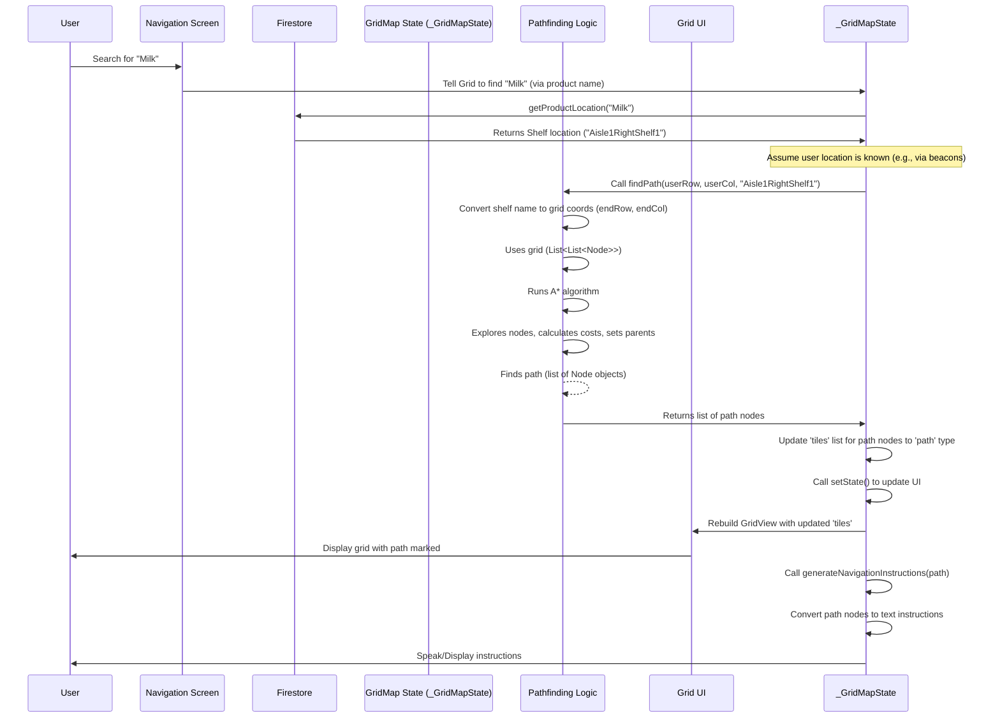

Let's look at snippets from the `findPath` function to see some of the steps:

First, it gets the start (user's) and end (product's shelf) coordinates. The user's location (`userRowIndex`, `userColIndex`) is updated by the beacon system (explained in the next chapter). The shelf location string (like 'Aisle1RightShelf1') is converted into specific grid coordinates using a `switch` statement.

```dart
// --- Snippet from lib/Grid_and_Navigation/grid.dart (inside findPath) ---
void findPath(int startX, int startY, String endLocation) {
  // Convert shelf location string to grid coordinates (row, col)
  int endX;
  int endY;
  switch (endLocation) {
    case 'Aisle1RightShelf1':
      endX = 27;
      endY = 29;
      break;
    // ... many more cases for other shelf locations ...
    default:
      print('Invalid location: $endLocation');
      return; // Stop if location is invalid
  }

  // Use the current user position as the start
  startX = userRowIndex;
  startY = userColIndex;

  Node startNode = grid[startX][startY];
  Node endNode = grid[endX][endY];

  // ... pathfinding algorithm starts here ...
}
```

Then, the pathfinding algorithm (the `while` loop) explores the grid of `Node` objects. We won't show the full A\* code here as it's quite long, but the core idea is to iterate through possible steps (`neighbors`), keep track of the best path found so far (`parent`), and add promising steps to the `openList` to explore later.

A crucial helper function is `getNeighbors`, which simply finds the tiles adjacent to the current one:

```dart
// --- Snippet from lib/Grid_and_Navigation/grid.dart ---
List<Node> getNeighbors(Node node) {
  List<Node> neighbors = [];
  // Check bounds to avoid going off the grid
  if (node.row > 0) neighbors.add(grid[node.row - 1][node.col]); // Up
  if (node.row < grid.length - 1) {
    neighbors.add(grid[node.row + 1][node.col]); // Down
  }
  if (node.col > 0) neighbors.add(grid[node.row][node.col - 1]); // Left
  if (node.col < grid[0].length - 1) {
    neighbors.add(grid[node.row][node.col + 1]); // Right
  }
  // Note: This version only checks up, down, left, right (no diagonals)
  return neighbors;
}
```

This ensures the pathfinding only considers moving one step at a time to an adjacent square.

Once the algorithm finds the `endNode`, it follows the `parent` nodes back to the `startNode` to get the sequence of tiles that make up the path.

This path is then used to update the `tiles` list:

```dart
// --- Snippet from lib/Grid_and_Navigation/grid.dart (inside findPath after path found) ---
    // Path found!
    List<Node> path = [];
    Node current = currentNode; // Start from the end node
    while (current != startNode) {
      path.add(current); // Add current node to path
      current = current.parent!; // Move back using the parent link
    }
    path.add(startNode); // Add the start node
    path = List.from(path.reversed); // Reverse to get path from start to end

    // Mark the path on the grid for display
    for (Node node in path) {
      tiles[node.row][node.col] = 'path'; // Change the tile type to 'path'
    }
    // Trigger a UI update to show the path
    setState(() {});

    // Generate spoken instructions
    generateNavigationInstructions(path);
    return; // Pathfinding is complete
```

Setting `tiles[node.row][node.col] = 'path';` changes the visual representation of those tiles. `setState(() {});` tells Flutter to redraw the screen, using the updated `tiles` list.

The `build` method uses `GridView.builder` to display the grid. The `_buildTileWidget` function determines the color of each individual square based on its type in the `tiles` list (walkable, non-walkable, path, user position, beacons, shelves).

```dart
// --- Snippet from lib/Grid_and_Navigation/grid.dart (inside _buildTileWidget) ---
Widget _buildTileWidget(String type, double tileSize, int rowIndex, int colIndex) {
  Color color;
  switch (type) {
    case 'walkable': color = Colors.greenAccent; break;
    case 'nonWalkable': color = Colors.grey; break;
    case 'path': color = Colors.blue; break; // Path color
    case 'beacon1': color = Colors.orange; break;
    // ... other cases for beacons and shelves ...
    default: color = Colors.transparent; break;
  }

  // Highlight the user's current position
  if (rowIndex == userRowIndex && colIndex == userColIndex) {
    color = Colors.blueAccent; // User icon color
  }

  return Container( // A simple box widget for the tile
    color: color,
    // ... padding/margin, optional text for debugging coordinates ...
  );
}
```

This function is called for every single square on the grid, drawing the map you see on the screen with different colors indicating walkable areas, obstacles, your location, and the calculated path.

Finally, the `generateNavigationInstructions` function takes the found path (the list of `Node` objects) and translates it into human-readable steps like "Move 10 steps forward", "Turn left", etc., often using Text-to-Speech (`flutterTts.speak`) to guide the user verbally (we'll touch more on voice features in [Voice Assistant Interaction](07_voice_assistant_interaction_.md)).

```dart
// --- Snippet from lib/Grid_and_Navigation/grid.dart (generateNavigationInstructions) ---
Future<void> generateNavigationInstructions(List<Node> path) async {
  List<String> instructions = [];
  // Logic to analyze the path (sequence of nodes)
  // and convert changes in direction/position into steps and turns.
  // Example:
  // If current.row < previous.row -> moving Up (forward)
  // If current.col > previous.col -> moving Right
  // When direction changes, generate an instruction like "Move X steps [direction]"
  // ... simplified logic ...

  // After generating instructions:
  for (String instruction in instructions) {
    print('Instruction: $instruction'); // Print to console
    await flutterTts.speak(instruction); // Speak the instruction
    // ... add a short delay ...
  }
}
```

This makes the app truly helpful by not just *showing* the path but also *telling* you how to follow it.

## Summary

In this chapter, we explored the core concept of store navigation:

*   We represent the store layout as a **grid** of tiles, marking walkable areas, obstacles, and special locations.
*   We use a **pathfinding algorithm** (like A\*) to calculate the most efficient route from the user's location to a product's location, avoiding obstacles.
*   This involves creating a grid of **Node** objects, which store information needed by the algorithm.
*   The path is found by exploring neighboring nodes, keeping track of costs and the path taken using `parent` links.
*   The calculated path is then visualized on the screen by updating the tile types in the `tiles` list and rebuilding the UI.
*   Finally, the path is used to generate spoken navigation instructions.

The pathfinding system relies on knowing both the destination (product location, from [Product & Purchase Database (Firestore)](05_product___purchase_database__firestore__.md)) and the starting point (user's location). How does the app figure out the user's location inside the store without GPS? That's the topic of our next chapter!

[Next Chapter: Indoor Positioning (Beacons)](04_indoor_positioning__beacons__.md)

---

<sub><sup>Generated by [AI Codebase Knowledge Builder](https://github.com/The-Pocket/Tutorial-Codebase-Knowledge).</sup></sub> <sub><sup>**References**: [[1]](https://github.com/Sehandu-Siriwardhana/AisleAide/blob/54a750566e84fa8dc4d576bf67f02843332dd958/aisleaide/lib/Grid_and_Navigation/grid.dart)</sup></sub>

# Chapter 4: Indoor Positioning (Beacons)

Welcome back, AisleAide navigators! In our [previous chapter](03_store_navigation_grid___pathfinding_.md), we learned how AisleAide uses a digital grid map of the store and clever pathfinding algorithms to figure out the best route to a product's location. This system is great, but it has a big problem: **How does the app know *where you are right now* inside the store to start the pathfinding from?**

Outside, your phone uses GPS satellites to pinpoint your location. But inside buildings, GPS signals usually can't reach. So, we need a different way to figure out your position indoors.

Think about when you're navigating inside a large airport or mall. Sometimes you see those big "You Are Here" maps. That's helpful, but you have to *find* the map first! AisleAide needs something like an automatic "You Are Here" marker that moves with you.

This is where **Indoor Positioning using Beacons** comes into play.

## What are Beacons?

Imagine small, battery-powered devices placed strategically around the store. These are **beacons**. Beacons are like tiny lighthouses that constantly broadcast a special signal using **Bluetooth Low Energy (BLE)**.

Unlike regular Bluetooth connections (like pairing headphones), beacons just send out information without needing to pair with your phone. Your AisleAide app, running on your phone, can **listen** for these signals.

Each beacon broadcasts a unique identifier. It's like each lighthouse having a unique name or number. The signal also has a **strength** that gets weaker the further away you are from the beacon.

By listening to these signals and checking how strong they are, the AisleAide app can estimate which beacons are nearby and roughly how far away they might be.

## How AisleAide Uses Beacons

AisleAide uses beacons as **indoor landmarks**. Here's the basic idea:

1.  **Beacons are Placed:** The store has several beacons installed at known locations (e.g., near the entrance, at the end of key aisles).
2.  **App Listens:** Your phone's Bluetooth is turned on, and the AisleAide app actively scans for these beacon signals.
3.  **Identify Beacons:** When the app detects a signal, it checks if the beacon's unique ID is one it recognizes as being in *this* store.
4.  **Measure Signal Strength:** The app measures the strength of the signal it receives from each recognized beacon. This is often measured in **RSSI** (Received Signal Strength Indicator) - a more negative number means a weaker signal (you're further away), and a less negative number means a stronger signal (you're closer).
5.  **Estimate Distance:** The app can use the signal strength (RSSI) and some known information about the beacon (like its transmission power) to make a rough *estimate* of how far away it is.
6.  **Determine Location:** By looking at which beacons are detected and how strong their signals are, the app can make an educated guess about your current location relative to those known beacon positions.

For simplicity in AisleAide, we use a very basic approach: we primarily determine your location based on **which beacon is detected as closest**, or in some cases, if *any* of the known beacons are detected at all, we might place you near a specific beacon location on the map.

## Connecting Beacons to the Grid

Remember the grid from [Chapter 3](03_store_navigation_grid___pathfinding_.md)? We marked some specific tiles on that grid as `beacon1`, `beacon2`, etc.

When the beacon system detects you are near, say, `beacon1`, the app updates your position on the grid (`userRowIndex`, `userColIndex`) to the known grid coordinates of `beacon1`. This provides the starting point for the pathfinding!

## Looking at the Code

Let's see how the app handles listening for beacons and updating your location.

The beacon listening logic is mainly handled in the `BeaconService` class (`lib/Firebase_and_beacons/beacon.dart`).

```dart
// --- Snippet from lib/Firebase_and_beacons/beacon.dart ---
import 'dart:async';
import 'package:flutter_blue_plus/flutter_blue_plus.dart'; // Bluetooth package

class BeaconService {
  // Holds known beacon IDs and their unique UUIDs
  static const Map<String, String> beaconUUIDs = {
    'beacon1': 'F7EA68EF-4477-418C-9447-07C6C5D07B0C',
    'beacon2': 'E63227F8-F830-4DCC-BEAB-B94C4A5FAA62',
    'beacon3': 'A5C2D3F6-EEDC-4973-AFAE-EB2A6304085B',
  };

  // This creates a single instance of the service (a "singleton")
  static final BeaconService _instance = BeaconService._internal();
  factory BeaconService() {
    return _instance;
  }
  BeaconService._internal();

  StreamSubscription<Map<String, bool>>? _beaconSubscription;

  // Starts scanning and returns a stream of beacon status updates
  Stream<Map<String, bool>> startBeaconTrackingStream() {
    // Listen to FlutterBluePlus's scan results
    return FlutterBluePlus.scanResults.asyncMap((scanResultList) {
      // Initialize a map to track which known beacons are detected
      Map<String, bool> beaconStatus = {
        'beacon1': false,
        'beacon2': false,
        'beacon3': false,
      };

      // Go through each detected Bluetooth device
      for (ScanResult scanResult in scanResultList) {
        // Check if its ID matches any of our known beacon UUIDs
        for (String key in beaconUUIDs.keys) {
          // Note: In a real scenario, we'd check advertising data, not just remoteId
          if (scanResult.device.remoteId.toString() == beaconUUIDs[key]) {
            beaconStatus[key] = true; // Mark this beacon as detected
          }
        }
      }
      return beaconStatus; // Send the status map downstream
    });
  }

  // Starts listening to the beacon stream and updates the grid
  void startBeaconTracking() async {
    _beaconSubscription = startBeaconTrackingStream().listen((beaconStatus) {
      // Call a method on the GridMapState to update user location
      gridMapKey.currentState?.updateUserLocationFromBeacon(beaconStatus);
    });
  }

  // Stops listening to the beacon stream
  void stopBeaconTracking() {
    _beaconSubscription?.cancel();
  }
}
```

*   `beaconUUIDs`: This map stores the unique identifiers of the beacons we expect to find in the store.
*   `startBeaconTrackingStream()`: This function uses the `flutter_blue_plus` package to start scanning for *any* Bluetooth devices. It then processes the `scanResultList` (the list of devices it sees). For each detected device, it checks if its ID matches any of the `beaconUUIDs`. It creates a map (`beaconStatus`) that tells us `true` if a known beacon was detected, `false` otherwise. This map is sent out as part of a stream.
*   `startBeaconTracking()`: This sets up a listener on the stream from `startBeaconTrackingStream()`. Whenever the stream sends out a new `beaconStatus` map (meaning the list of detected beacons might have changed), it calls `gridMapKey.currentState?.updateUserLocationFromBeacon(beaconStatus);`. This is how the beacon service talks to the grid map to update the user's position.
*   `stopBeaconTracking()`: Cleans up the listener when the navigation screen is closed.

Now, let's look at the `_GridMapState` class in `lib/Grid_and_Navigation/grid.dart` to see how it receives this information and updates the user's position.

```dart
// --- Snippet from lib/Grid_and_Navigation/grid.dart ---
// GlobalKey allows us to access the state of GridMap from outside
GlobalKey<_GridMapState> gridMapKey = GlobalKey<_GridMapState>();

class _GridMapState extends State<GridMap> {
  // ... other state variables like tiles, flutterTts, grid ...

  int userRowIndex = 56; // User's current row index
  int userColIndex = 33; // User's current column index

  // This method is called by the BeaconService when beacon status changes
  void updateUserLocationFromBeacon(Map<String, bool> beaconStatus) {
    int newRow = userRowIndex; // Start with current position
    int newCol = userColIndex;

    // --- Simplified Location Logic (Closest Beacon) ---
    // This is a basic approach for demonstration.
    // More complex methods would use distances from multiple beacons.

    // Check which beacon(s) were detected (status is true)
    if (beaconStatus['beacon1'] == true) {
       // If beacon1 is detected, move user towards beacon1's grid location
       newRow = 0; // Beacon1 Row
       newCol = 33; // Beacon1 Col
       print("User near Beacon 1. Updating location.");
    } else if (beaconStatus['beacon2'] == true) {
       // If beacon2 is detected, move user towards beacon2's grid location
       newRow = 31; // Beacon2 Row
       newCol = 0;  // Beacon2 Col
       print("User near Beacon 2. Updating location.");
    } else if (beaconStatus['beacon3'] == true) {
       // If beacon3 is detected, move user towards beacon3's grid location
       newRow = 63; // Beacon3 Row
       newCol = 33; // Beacon3 Col
       print("User near Beacon 3. Updating location.");
    } else {
        // Optional: Handle case where no known beacon is detected
        print("No known beacons detected.");
        // Could potentially keep the last known position,
        // or move to a default 'unknown' location.
    }
    // --- End Simplified Location Logic ---

    // Update the state if the location changed
    if (newRow != userRowIndex || newCol != userColIndex) {
      setState(() {
        userRowIndex = newRow;
        userColIndex = newCol;
      });
      // Note: In a real app, you might recalculate the path here
      // if the user's position significantly changed and a path was active.
    }
  }

  // ... other methods like initializeGrid, createGrid, findPath, _buildTileWidget ...

  // Inside the build method, userRowIndex and userColIndex are used
  // to draw the user icon on the grid:
  @override
  Widget build(BuildContext context) {
     // ... GridView.builder setup ...
     itemBuilder: (context, index) {
        // ... calculate rowIndex, colIndex ...
        return _buildTileWidget(
           tiles[rowIndex][colIndex], // Get tile type
           tileSize, rowIndex, colIndex
        );
     },
  }

  Widget _buildTileWidget(...) {
    // ... determine tile color based on type ...

    // Highlight the user's current position
    if (rowIndex == userRowIndex && colIndex == userColIndex) {
      color = Colors.blueAccent; // User icon color
    }

    return Container(...); // Draw the tile
  }
}
```

*   `gridMapKey`: This `GlobalKey` is important! It allows the `BeaconService` (which is a different class) to get a reference to the *current state* of the `GridMap` widget (`_GridMapState`) so it can call methods on it, specifically `updateUserLocationFromBeacon`.
*   `userRowIndex`, `userColIndex`: These state variables hold the user's current position on the grid.
*   `updateUserLocationFromBeacon(Map<String, bool> beaconStatus)`: This method is the bridge. It receives the `beaconStatus` map from the `BeaconService`.
*   **Simplified Location Logic:** The example snippet shows a basic rule: if Beacon 1 is detected, assume the user is at Beacon 1's location on the grid. This is a simplification; a more complex app might use RSSI values from *multiple* beacons to calculate a more precise position (trilateration). But for this tutorial, simply mapping to the detected beacon's location is sufficient to understand the concept.
*   `setState(() { ... });`: If the calculated `newRow` or `newCol` is different from the current location, `setState` is called. This tells Flutter that the state has changed and the `build` method needs to run again.
*   The `build` method uses the updated `userRowIndex` and `userColIndex` when drawing the grid tiles (`_buildTileWidget`), changing the color of the tile at the user's location to show their position on the map.

This process ensures that as you move around the store and your phone detects different beacons, your position on the grid map updates accordingly.

## The Indoor Positioning Flow (Simplified)

Here's a diagram showing how the pieces connect:

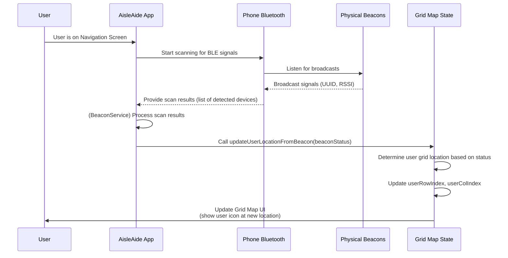

This diagram shows the loop: The app listens for signals, processes them to find your rough location, and updates the visual map. This happens continuously as you move through the store.

## Summary

In this chapter, we learned how AisleAide tackles indoor positioning without GPS:

*   It uses small Bluetooth devices called **beacons** as indoor landmarks.
*   Beacons broadcast unique identifiers via **Bluetooth Low Energy (BLE)**.
*   The app listens for these signals and measures their **strength (RSSI)**.
*   By identifying known beacons and their signal strength, the app **estimates your location** (in our simplified model, by identifying the closest detected beacon).
*   This estimated location is translated into **grid coordinates** (`userRowIndex`, `userColIndex`) for the [Store Navigation Grid & Pathfinding](03_store_navigation_grid___pathfinding_.md) system.
*   The `BeaconService` listens for signals and calls a method on the `_GridMapState` to update the user's position on the map UI.

Now that we know *who* you are (Chapter 2), have a map and can find routes ([Chapter 3](03_store_navigation_grid___pathfinding_.md)), and know *where you are* on that map, the next crucial step is understanding the store's contents: **the products!** How does the app know what products are available and where they are located?

[Next Chapter: Product & Purchase Database (Firestore)](05_product___purchase_database__firestore__.md)

---

<sub><sup>Generated by [AI Codebase Knowledge Builder](https://github.com/The-Pocket/Tutorial-Codebase-Knowledge).</sup></sub> <sub><sup>**References**: [[1]](https://github.com/Sehandu-Siriwardhana/AisleAide/blob/54a750566e84fa8dc4d576bf67f02843332dd958/aisleaide/lib/Firebase_and_beacons/beacon.dart), [[2]](https://github.com/Sehandu-Siriwardhana/AisleAide/blob/54a750566e84fa8dc4d576bf67f02843332dd958/aisleaide/lib/Grid_and_Navigation/grid.dart)</sup></sub>

# Chapter 5: Product & Purchase Database (Firestore)

Welcome back, AisleAide users! In our [previous chapter](04_indoor_positioning__beacons__.md), we figured out how AisleAide knows *where you are* inside the store using beacons. Now that we know your location on the store map, we need to answer another crucial question: **What products are actually *in* this store, where exactly are they located, and what have you bought before?**

Knowing where you are on the map isn't very helpful if the map doesn't tell you where the milk or bread is! We need a central place to store all this important information about the store's items and your shopping history.

This is where our **Product & Purchase Database** comes in. For AisleAide, we use a cloud database service provided by Google called **Firestore**.

Think of Firestore as a smart, digital filing cabinet stored securely in the cloud. It can hold lots of different "folders" (called **Collections**), and inside each folder are many "files" (called **Documents**). Each document holds structured information, like details about a single product or a record of one shopping trip.

Why use a cloud database like Firestore?

*   **Accessible Everywhere:** The app on your phone can read from and write to it from anywhere with internet access.
*   **Stores Lots of Data:** It can handle a large number of products and purchases.
*   **Organized:** It keeps information structured, making it easy to find what you need.
*   **Real-time Updates:** You can even set it up to notify your app automatically when data changes (though we primarily use one-time reads in AisleAide's current form for simplicity).
*   **Managed by Google:** You don't have to worry about setting up and maintaining the database servers yourself.

In AisleAide, Firestore is mainly used to store two key types of data:

1.  **Products:** Information about every item the store sells.
2.  **Purchases:** A history of your completed shopping trips.

Let's look at how we use this database for common tasks, like finding a product and checking its price.

## Finding Products: The "Products" Collection

When you use the app to search for a product (like "milk"), the app needs to know:

*   Does the store sell "milk"?
*   If yes, what's its price?
*   If yes, where is it located in the store (which shelf)?

This information is stored in the `Products` collection in Firestore. Each document in this collection represents a single product.

A typical product document might look something like this (in simplified terms):

```json
// A single document in the 'Products' collection
{
  "Product Name": "milk",
  "Price": 550, // Price in LKR
  "Shelf": "Aisle3LeftShelf1" // Location in the store
}
```

The app needs to query this collection to find the document for the product you searched for.

Let's see a simplified version of the code that does this in the `_GridMapState` class (`lib/Grid_and_Navigation/grid.dart`). This code is triggered when the `NavigationScreen` asks the `GridMap` to find a product after you search for it (we'll look at searching in [Product Scanner (Image Recognition)](06_product_scanner__image_recognition__.md), but for now, assume the product name is given).

```dart
// --- Simplified Snippet from lib/Grid_and_Navigation/grid.dart ---
import 'package:cloud_firestore/cloud_firestore.dart'; // Import Firestore

// ... other imports and class definition ...

Future<String?> getProductLocation(String productName) async {
  try {
    print('Searching for product: $productName');
    // 1. Get a reference to the 'Products' collection
    CollectionReference productsCollection =
        FirebaseFirestore.instance.collection('Products');

    // 2. Create a query to find documents where 'Product Name' matches the given name
    QuerySnapshot querySnapshot = await productsCollection
        .where('Product Name', isEqualTo: productName.toLowerCase())
        .get(); // Execute the query

    print('Query executed');

    // 3. Check if any documents were found
    if (querySnapshot.docs.isNotEmpty) {
      // 4. Get the data from the first matching document
      Map<String, dynamic> data =
          querySnapshot.docs.first.data() as Map<String, dynamic>;

      // 5. Retrieve the 'Shelf' field
      String? shelfLocation = data['Shelf'];

      print('Product location found: $shelfLocation');
      return shelfLocation; // Return the location string
    } else {
      // Product not found
      print('Product not found in the database.');
      return null;
    }
  } catch (error) {
    // Handle errors during the database operation
    print('Error retrieving product location: $error');
    return null;
  }
}
// ... rest of the _GridMapState code ...
```

*   `FirebaseFirestore.instance`: This gives us access to the Firestore database instance connected to our Firebase project.
*   `.collection('Products')`: This points to the "Products" folder (collection) in the database.
*   `.where('Product Name', isEqualTo: productName.toLowerCase())`: This filters the documents in the collection. We only want documents where the field named "Product Name" has a value equal to the `productName` we are searching for (converted to lowercase for consistency).
*   `.get()`: This executes the query and fetches the matching documents *once*.
*   `querySnapshot`: This object holds the results of the query. It contains a list of `docs` (documents) that matched the query.
*   `querySnapshot.docs.first.data()`: We grab the first document that matched (assuming product names are unique) and get its data as a map (like a dictionary).
*   `data['Shelf']`: From the document's data, we extract the value associated with the key "Shelf".

If a matching product is found, this function returns the `shelfLocation` string (like 'Aisle3LeftShelf1'). This string is then used by the pathfinding logic (as seen in [Chapter 3](03_store_navigation_grid___pathfinding_.md)) to find the coordinates on the grid and calculate the path.

Here's a simple diagram of this product lookup process:

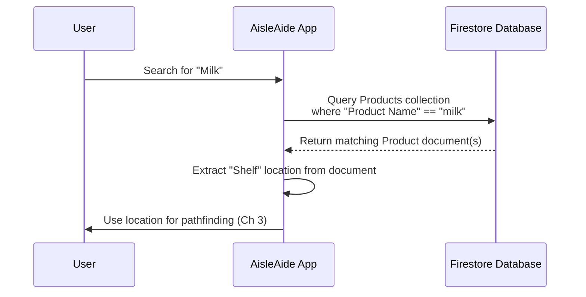

## Getting Product Price for the Cart

Similarly, when you add a product to your shopping cart (on the `CartScreen`), the app needs to know the price to calculate the total. This also involves querying the `Products` collection.

Let's look at the `_fetchProductPrice` function in the `_CartScreenState` class (`lib/Voice_assistant_and_database/cart_screen.dart`):

```dart
// --- Simplified Snippet from lib/Voice_assistant_and_database/cart_screen.dart ---
import 'package:cloud_firestore/cloud_firestore.dart'; // Import Firestore

// ... other imports and class definition ...

Future<double?> _fetchProductPrice(String productName) async {
  try {
    // 1. Query the 'Products' collection
    final QuerySnapshot<Map<String, dynamic>> products = await FirebaseFirestore
        .instance
        .collection('Products')
        .where('Product Name', isEqualTo: productName) // Find by name
        .get(); // Get results once

    // 2. Check if product found
    if (products.docs.isNotEmpty) {
      // 3. Get data from the first document
      final product = products.docs.first.data();
      // 4. Extract the 'Price' field (assuming it's stored as an integer)
      final int productPrice = product['Price'];
      return productPrice.toDouble(); // Return the price as a double
    }
    // 5. Return null if product not found
    return null;
  } catch (error) {
    // Handle errors
    print('Error fetching product price: $error');
    return null;
  }
}
// ... rest of the _CartScreenState code ...
```

This code is very similar to `getProductLocation`, but instead of extracting the "Shelf", it extracts the "Price". This price is then used to update the `_totalAmount` state variable on the `CartScreen`, which triggers the UI to show the updated total.

Here's a simple diagram for fetching the price:

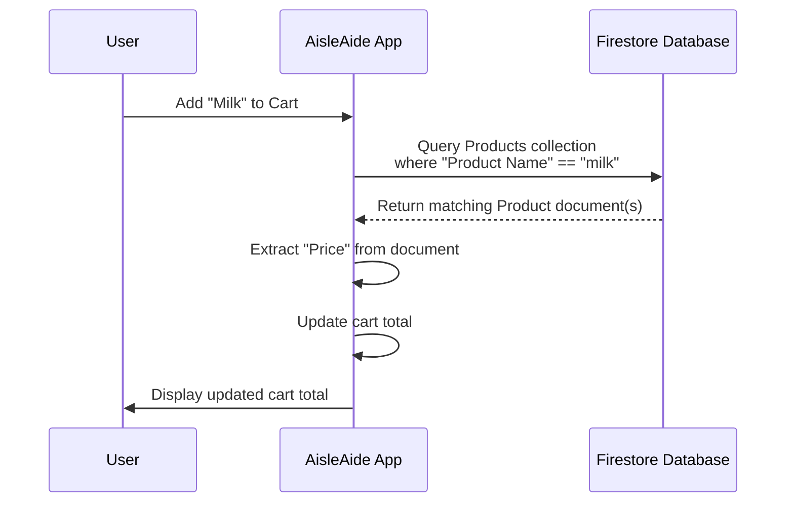

These examples show how the app reads data from the `Products` collection to get details needed for navigation and cart management.

## Recording Purchases: The "Purchases" Collection

AisleAide also keeps track of your past shopping trips. This is useful for reviewing what you bought or even generating a shopping list based on past purchases. This history is stored in the `Purchases` collection in Firestore.

Each document in the `Purchases` collection represents one completed shopping trip.

A purchase document might look like this:

```json
// A single document in the 'Purchases' collection
{
  "purchaseDate": "Timestamp(...)", // When the purchase happened
  "purchasesTotal": 1250, // Total amount
  "purchaseItems": [ // A list of items bought
    {"productName": "milk", "productQuantity": 1, "ProductsTotal": 550},
    {"productName": "bread", "productQuantity": 1, "ProductsTotal": 700}
  ]
  // In a real app, you'd likely also include a field
  // linking this purchase to the user's ID (from Chapter 2)
  // to only show *your* purchases.
}
```

When you complete a shopping trip (in this simplified app, this might happen when viewing the cart or navigating away), the app can save the current contents of your cart as a new document in the `Purchases` collection.

Here's a simplified idea of how saving a purchase would work (this exact method isn't explicitly shown as a single public method in the provided code snippets, but the logic is implemented within screen classes like `CartScreen` if a checkout process existed):

```dart
// --- Simplified Concept: How a Purchase Document Might Be Saved ---
import 'package:cloud_firestore/cloud_firestore.dart';

Future<void> savePurchase(List<Map<String, dynamic>> cartItems, double totalAmount) async {
  try {
    // 1. Get a reference to the 'Purchases' collection
    CollectionReference purchasesCollection =
        FirebaseFirestore.instance.collection('Purchases');

    // 2. Create a new document with the purchase data
    await purchasesCollection.add({
      'purchaseDate': Timestamp.now(), // Save the current date/time
      'purchasesTotal': totalAmount.toInt(), // Save the total amount
      'purchaseItems': cartItems, // Save the list of items
      // 'userId': FirebaseAuth.instance.currentUser?.uid, // Link to the user (optional but good practice)
    });

    print('Purchase saved successfully!');
  } catch (error) {
    print('Error saving purchase: $error');
  }
}
```

*   `purchasesCollection.add({...})`: This is how you add a new document to a collection. Firestore automatically generates a unique ID for the new document.
*   `Timestamp.now()`: This saves the current date and time in a special Firestore format.
*   We package the `cartItems` list and `totalAmount` into a map that Firestore can understand and save.

Here's a simple diagram of saving a purchase:

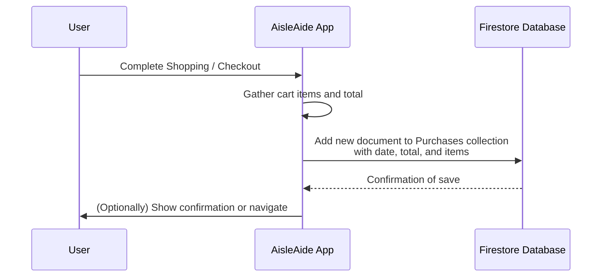

## Viewing Purchase History: Reading from "Purchases"

The `RecentShoppingScreen` ([`recent_shopping_screen.md`](recent_shopping_screen.md)) needs to read all the past purchases from the `Purchases` collection to display them to the user.

Let's look at how the `_RecentShoppingScreenState` gets this data:

```dart
// --- Simplified Snippet from lib/Voice_assistant_and_database/recent_shopping_screen.dart ---
import 'package:cloud_firestore/cloud_firestore.dart'; // Import Firestore

// ... other imports and class definition ...

// Stream to fetch the user's recent shopping data
Stream<QuerySnapshot>? _usersStream; // This will hold the stream of data

@override
void initState() {
  super.initState();
  // ... other initialization ...
  // Initialize the stream when the screen starts
  _usersStream = _getInitialStream();
}

// Method to get the initial stream of purchases
Stream<QuerySnapshot> _getInitialStream() {
  return FirebaseFirestore.instance
      .collection('Purchases')
      // .where('userId', isEqualTo: FirebaseAuth.instance.currentUser?.uid) // Filter by user (good practice)
      .orderBy('purchaseDate', descending: true) // Show newest purchases first
      .snapshots(); // Get a stream of updates
}

// ... Method to filter by date (_getFilteredStream) ...

@override
Widget build(BuildContext context) {
  return Scaffold(
    // ... UI setup ...
    body: Column(
      children: [
        // ... Date filter UI ...
        Expanded(
          // StreamBuilder listens to the stream and rebuilds UI when data changes
          child: StreamBuilder<QuerySnapshot>(
            stream: _usersStream, // The stream we created
            builder: (BuildContext context, AsyncSnapshot<QuerySnapshot> snapshot) {
              // Handle different states of the stream (loading, error, data)
              if (snapshot.hasError) {
                return const Text("Something went wrong");
              }
              if (snapshot.connectionState == ConnectionState.waiting) {
                return const Text("Loading");
              }
              if (snapshot.data!.docs.isEmpty){
                return const Text("No data found");
              }

              // If we have data, build a ListView to display it
              return ListView.builder(
                itemCount: snapshot.data!.docs.length,
                itemBuilder: (context, index) {
                  // Get data for each purchase document
                  Map<String, dynamic> data =
                      snapshot.data!.docs[index].data() as Map<String, dynamic>;

                  // Extract fields like date, total, and items
                  Timestamp purchaseTimestamp = data['purchaseDate'];
                  int totalProducts = data['purchasesTotal'];
                  List<dynamic> purchaseDetails = data['purchaseItems'];

                  // Format date and display summary
                  String formattedDate = DateFormat('yyyy.MM.dd hh:mma').format(purchaseTimestamp.toDate());

                  return ListTile(
                    title: Text('Date: $formattedDate'),
                    subtitle: Text('Total: LKR $totalProducts'),
                    // On tap, show details from purchaseDetails list
                    onTap: () {
                       // _showPurchaseDetails(...) // Function to show detailed items
                    },
                  );
                },
              );
            },
          ),
        ),
      ],
    ),
    // ... Floating action button ...
  );
}
// ... rest of the _RecentShoppingScreenState code ...
```

*   `_getInitialStream()`: This function sets up the query to the `Purchases` collection.
*   `.orderBy('purchaseDate', descending: true)`: This sorts the results so the newest purchases appear first.
*   `.snapshots()`: **This is key for reading history!** Instead of `.get()` which fetches data once, `.snapshots()` gives you a *stream* of data. This stream will emit a new `QuerySnapshot` every time the data in the `Purchases` collection changes (e.g., a new purchase is added).
*   `StreamBuilder<QuerySnapshot>`: This Flutter widget is designed to listen to a `Stream`. Whenever the `_usersStream` emits new data (a new `QuerySnapshot`), the `StreamBuilder`'s `builder` function is called, allowing the UI to update automatically with the latest purchase history.
*   Inside the `builder`, we check the `snapshot` to see if there's data, if it's still loading, or if there was an error.
*   If `snapshot.hasData` is true and it's not waiting, we access the `snapshot.data!.docs` (the list of purchase documents) and use `ListView.builder` to display each one, extracting the data from the document map.

This setup makes the `RecentShoppingScreen` dynamically update if new purchases are somehow added or changed while you're viewing the screen.

Here's a diagram for fetching purchase history:

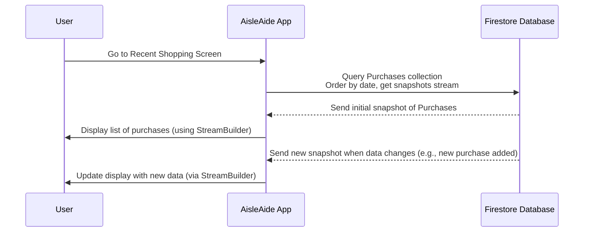

## Summary

In this chapter, we learned about the role of the **Product & Purchase Database** using Google's **Firestore**:

*   Firestore is a cloud database that stores our app's persistent data in **Collections** of **Documents**.
*   The **`Products` collection** stores details about items (Name, Price, Shelf Location), which are queried to find products and get their prices for the cart and navigation.
*   The **`Purchases` collection** stores records of completed shopping trips (Date, Total, List of Items).
*   We use `FirebaseFirestore.instance.collection(...).where(...).get()` to fetch data *once* (e.g., finding a product's location or price).
*   We use `FirebaseFirestore.instance.collection(...).orderBy(...).snapshots()` to get a *stream* of data for dynamic displays like the recent purchases list.
*   We use `collection(...).add({...})` to save new data, like recording a completed purchase.

This database is central to the app's ability to provide product information and keep track of user activity.

Now that we know how to store and retrieve product information, the next logical step is to explore how the app can identify products, not just by searching, but by actually looking at them!

[Next Chapter: Product Scanner (Image Recognition)](06_product_scanner__image_recognition__.md)

---

<sub><sup>Generated by [AI Codebase Knowledge Builder](https://github.com/The-Pocket/Tutorial-Codebase-Knowledge).</sup></sub> <sub><sup>**References**: [[1]](https://github.com/Sehandu-Siriwardhana/AisleAide/blob/54a750566e84fa8dc4d576bf67f02843332dd958/aisleaide/lib/Firebase_and_beacons/fire_function.dart), [[2]](https://github.com/Sehandu-Siriwardhana/AisleAide/blob/54a750566e84fa8dc4d576bf67f02843332dd958/aisleaide/lib/Grid_and_Navigation/grid.dart), [[3]](https://github.com/Sehandu-Siriwardhana/AisleAide/blob/54a750566e84fa8dc4d576bf67f02843332dd958/aisleaide/lib/Voice_assistant_and_database/cart_screen.dart), [[4]](https://github.com/Sehandu-Siriwardhana/AisleAide/blob/54a750566e84fa8dc4d576bf67f02843332dd958/aisleaide/lib/Voice_assistant_and_database/recent_shopping_screen.dart), [[5]](https://github.com/Sehandu-Siriwardhana/AisleAide/blob/54a750566e84fa8dc4d576bf67f02843332dd958/aisleaide/lib/Voice_assistant_and_database/search_products_screen.dart)</sup></sub>

# Chapter 6: Product Scanner (Image Recognition)

Welcome back, AisleAide users! In our [previous chapter](05_product___purchase_database__firestore_.md), we learned how AisleAide stores and retrieves information about products and your shopping history using a cloud database called Firestore. Knowing *about* the products is essential for features like navigation and managing your cart.

But what if you're just walking down an aisle and see a product you want to add quickly, or you want to check its price or location without typing? This is where typing can slow you down.

Wouldn't it be great if you could just **point your phone's camera at the product, and the app instantly recognizes it**?

This is exactly what the **Product Scanner (Image Recognition)** system in AisleAide does! It's like giving the app the ability to *see* and identify products in the real world.

## What is Product Scanning?

Imagine you pick up a box of cereal. Instead of searching for "cereal" in the app, you open the "Product Scan" screen, point your camera at the box, and within moments, the app says "Recognized: Corn Flakes" and maybe shows the price or asks if you want to add it to your cart.

This is powered by a clever technique called **Image Recognition**, specifically using a pre-trained computer model.

Think of it like this:

1.  Your phone's camera captures a picture (or more accurately, a stream of pictures, like a video feed).
2.  The app takes these pictures and feeds them into a special "brain" (the trained model).
3.  This "brain" has been trained beforehand by looking at *thousands* of pictures of different products.
4.  When it sees a new picture (from your camera), the brain tries to figure out which product it looks most similar to from all the pictures it saw during training.
5.  The brain tells the app, "I think this is Corn Flakes!"

In AisleAide, this "brain" is a **TFLite model**. TFLite (TensorFlow Lite) is a format designed for running machine learning models on mobile devices efficiently.

## Key Concepts: The Camera and the Brain

To make this work, the app needs two main things:

1.  **Access to the Camera:** To get the images of the products.
2.  **The Trained Model (TFLite):** The "brain" that does the recognition.

Let's look at how the app handles these. All this functionality is managed within the `CameraScreen` widget (`lib/Voice_assistant_and_database/camera_screen.dart`).

### 1. Accessing the Camera

Flutter provides packages to interact with the device's camera. The `camera` package is commonly used for this. Before we can use the camera, we usually need to ask the user for permission.

The camera setup is handled in the `ScanController` class (using the `Getx` library for state management, which helps organize complex logic like this).

Here's a simplified view of the camera initialization:

```dart
// --- Simplified Snippet from lib/Voice_assistant_and_database/camera_screen.dart ---
import 'package:camera/camera.dart'; // Camera package
import 'package:permission_handler/permission_handler.dart'; // Permission package

class ScanController extends GetxController {
  CameraController? cameraController; // Manages the camera

  initCamera() async {
    // 1. Ask for camera permission
    if (await Permission.camera.request().isGranted) {
      // 2. Get available cameras
      List<CameraDescription> cameras = await availableCameras();
      // 3. Select the first camera and create a controller
      cameraController = CameraController(
        cameras[0], // Use the first available camera (usually back camera)
        ResolutionPreset.medium, // Set resolution
      );
      // 4. Initialize the controller
      await cameraController?.initialize();
      // 5. Start receiving images from the camera stream
      cameraController?.startImageStream((image) async {
        // This function is called for each new image frame!
        // We will feed this 'image' into our model later.
        // ... call objectDetector here ...
      });
      // ... update state to show camera is ready ...
    } else {
      // Handle permission denied
      print("Camera permission denied");
    }
  }
  // ... rest of ScanController ...
}
```

*   `Permission.camera.request()`: This line is crucial for privacy – it asks the user if the app can use the camera.
*   `availableCameras()`: Gets a list of cameras on the device.
*   `CameraController(...)`: Sets up how we want to use a specific camera (which one, what resolution).
*   `cameraController?.initialize()`: Prepares the camera to start taking pictures.
*   `cameraController?.startImageStream(...)`: This is important! Instead of taking a single picture, this starts a flow of images coming from the camera continuously, like a video. The function provided (`(image) async { ... }`) is called repeatedly for every new image frame. This `image` is what we'll feed to the recognition model.

Once the camera is initialized, the `CameraView` widget displays the camera feed using `CameraPreview(controller.cameraController!)`.

### 2. Loading the Trained Model (TFLite)

The "brain" of our scanner is stored in a file, specifically a TFLite model file (`.tflite`) and a corresponding labels file (`.txt`) that lists what the model can recognize. These files are usually bundled with the app in the `assets` folder.

Loading the model is handled in the `ScanController` using the `tflite_v2` package:

```dart
// --- Simplified Snippet from lib/Voice_assistant_and_database/camera_screen.dart ---
import 'package:tflite_v2/tflite_v2.dart'; // TFLite package

class ScanController extends GetxController {
  // ... cameraController and other variables ...

  initTflite() async {
    // Load the model and labels from the assets folder
    await Tflite.loadModel(
      model: "assets/model_unquant.tflite", // The brain file
      labels: "assets/labels.txt", // The list of things it knows
      isAsset: true, // Tell it the files are in assets
      numThreads: 1, // How many parallel tasks to use (keep it simple)
      useGpuDelegate: false, // Don't use GPU (simpler)
    );
  }
  // ... rest of ScanController ...
}
```

*   `Tflite.loadModel(...)`: This function from the `tflite_v2` package reads the model and labels files and prepares the model to be used. The model is now ready to process images.

## Running the Recognition (Object Detection)

Now that we have the camera providing image frames and the model loaded, we need to feed the images to the model and get the results. This is often called **Object Detection** or **Image Classification**.

The `objectDetector` function in `ScanController` does this:

```dart
// --- Simplified Snippet from lib/Voice_assistant_and_database/camera_screen.dart ---
import 'package:camera/camera.dart'; // For CameraImage type
import 'package:tflite_v2/tflite_v2.dart'; // TFLite package

class ScanController extends GetxController {
  // ... cameraController, detectionResults variable ...

  objectDetector(CameraImage image) async {
    // Run the loaded model on the given camera image frame
    var detector = await Tflite.runModelOnFrame(
      bytesList: image.planes.map((e) { return e.bytes; }).toList(), // Image data
      asynch: true, // Run asynchronously
      imageHeight: image.height, // Image dimensions
      imageWidth: image.width,
      imageMean: 127.5, // Normalization values used during model training
      imageStd: 127.5,
      numResults: 1, // We only want the top 1 result
      rotation: 90, // How the image needs to be rotated for the model
      threshold: 0.4, // Minimum confidence level to consider a result
    );

    if (detector != null && detector.isNotEmpty) {
      // 'detector' contains the results (label, confidence, etc.)
      // Extract the label(s) from the results
      detectionResults.value = detector.map((result) => result['label']).toList();
      print('Detected: ${detectionResults.join(', ')}'); // Log the detected label
      // ... update UI ...
    }
  }
  // ... rest of ScanController ...
}
```

*   `Tflite.runModelOnFrame(...)`: This is the core function that performs the recognition. It takes the image data (`bytesList`), information about the image, and some parameters (like how many results to give back and how confident it needs to be).
*   `detector`: The result from the model. It's usually a list of maps, where each map describes a detected object (its label, confidence score, and sometimes bounding box coordinates).
*   `detector.map((result) => result['label']).toList()`: We process the results to simply extract the `label` string for each detection.
*   `detectionResults.value = ...`: This updates a special variable (`detectionResults`) that the UI is watching, so the screen can update automatically to show what was detected.

In the provided code, `objectDetector` is called inside the `startImageStream` callback, but only for every 10th frame (`cameraCount % 10 == 0`). This is done to save processing power and prevent the app from running the model constantly on every single frame, which can be slow on mobile devices.

## Displaying the Result

The `CameraView` widget is responsible for showing the camera feed and the detection results. It uses a `Stack` to place the camera preview at the bottom and the detected product details as text overlaid on top, usually at the bottom of the screen.

```dart
// --- Simplified Snippet from lib/Voice_assistant_and_database/camera_screen.dart ---
import 'package:camera/camera.dart'; // For CameraPreview
import 'package:get/get.dart'; // For GetBuilder and Obx

class CameraView extends StatelessWidget {
  const CameraView({super.key});

  @override
  Widget build(BuildContext context) {
    return Scaffold(
      body: GetBuilder<ScanController>( // Listens to changes in ScanController
        init: ScanController(), // Initialize the controller
        builder: (controller) {
          if (!controller.isCameraInitialized.value) {
            return const Center(child: Text("Loading..."));
          }
          // Use a Stack to layer widgets
          return Stack(
            children: [
              // 1. Display the camera feed
              CameraPreview(controller.cameraController!),
              // 2. Overlay the detection results text at the bottom
              Align(
                alignment: Alignment.bottomCenter,
                child: Container(
                  padding: const EdgeInsets.all(12.0),
                  color: Colors.green.withOpacity(0.5), // Semi-transparent background
                  child: Obx(() => Text( // Obx rebuilds when detectionResults changes
                    'Product Details: ${controller.detectionResults.join(', ')}', // Show detected labels
                    style: const TextStyle(
                      color: Colors.white,
                      fontSize: 24,
                    ),
                  )),
                ),
              ),
            ],
          );
        },
      ),
    );
  }
}
```

*   `GetBuilder<ScanController>`: This widget from the `Getx` library watches the `ScanController`. When the controller calls `update()`, the `builder` function is rerun, rebuilding the UI.
*   `Obx(() => Text(...))`: This widget specifically watches `controller.detectionResults`. Since `detectionResults` is an `RxList` (an "observable" list provided by Getx), `Obx` automatically rebuilds *just the Text widget* whenever the list of detected items changes, showing the latest recognized product labels.

## How it All Fits Together

Here's a simplified flow of the Product Scanner:

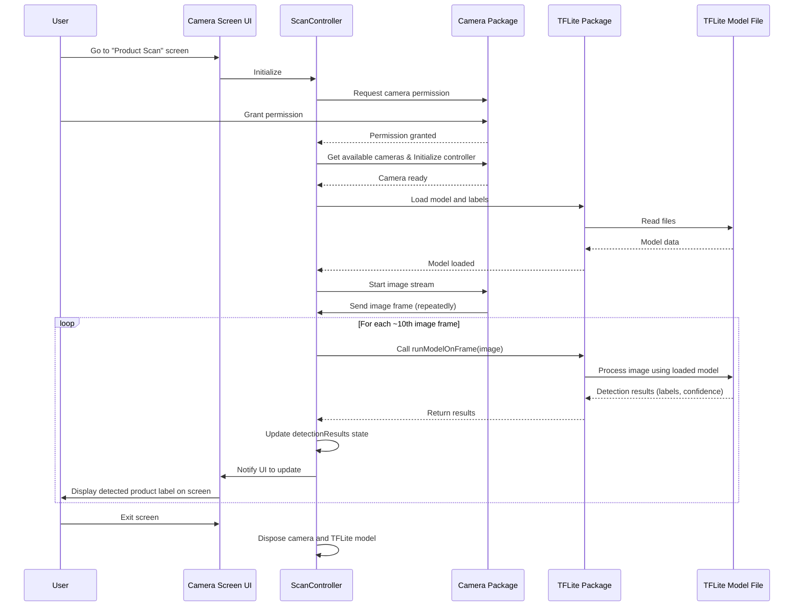

This diagram shows the continuous loop: The camera sends images, the controller feeds them to the model, gets results, updates its state, and the UI reacts to show the user what was detected.

Once a product is recognized (e.g., "Corn Flakes"), the app *could* then use the name "Corn Flakes" to:

*   Look up its price and location in the [Product & Purchase Database (Firestore)](05_product___purchase_database__firestore_.md).
*   Prompt the user to add it to their cart.
*   Potentially even show the path to it if needed (though scanning is often used when you've already found the item).

## Summary

In this chapter, we explored the Product Scanner:

*   It uses your phone's camera to **visually identify products**.
*   This is powered by a **TFLite model**, a pre-trained "brain" for image recognition.
*   The app gets a continuous stream of images from the camera using the `camera` package.
*   It loads the TFLite model and labels using the `tflite_v2` package.
*   It repeatedly feeds the camera images into the model (`runModelOnFrame`) to get detection results (like the product label).
*   The detected labels are displayed on the `CameraScreen` UI, overlaying the camera feed.

This system provides a fast and intuitive way to interact with products in the real world and bridge that interaction with the app's digital information.

This brings us to another intuitive way to interact with the app: using your voice!

[Next Chapter: Voice Assistant Interaction](07_voice_assistant_interaction_.md)

---

<sub><sup>Generated by [AI Codebase Knowledge Builder](https://github.com/The-Pocket/Tutorial-Codebase-Knowledge).</sup></sub> <sub><sup>**References**: [[1]](https://github.com/Sehandu-Siriwardhana/AisleAide/blob/54a750566e84fa8dc4d576bf67f02843332dd958/aisleaide/lib/Voice_assistant_and_database/camera_screen.dart)</sup></sub>

# Chapter 7: Voice Assistant Interaction

Welcome back, AisleAide users! In our [previous chapter](06_product_scanner__image_recognition_.md), we explored how the app can "see" products using image recognition. That's one way to interact with the app without typing, but what if your hands are full, or you simply prefer talking?

Imagine you're pushing a heavy cart or reaching for an item on a high shelf. Pulling out your phone, unlocking it, finding the search bar, and typing can be awkward.

This is where the **Voice Assistant Interaction** feature comes in! It allows you to talk to AisleAide, making your shopping experience smoother and more hands-free.

Think of it like having a helpful store assistant built right into your phone. You can just say what you need, and the app tries to understand and respond.

The core idea is to let you:

1.  **Speak commands:** "Where is milk?" or "Go to the cart screen."
2.  **Hear responses:** The app can talk back to confirm actions or provide information.

To make this possible, AisleAide uses a few clever technologies working together:

*   **Speech-to-Text (STT):** Converts your spoken words into written text that the app can read.
*   **Dialogflow:** An AI service that understands the *meaning* of your text commands (like figuring out you want to find a product vs. navigate to a different screen).
*   **Text-to-Speech (TTS):** Converts the app's text responses back into spoken words you can hear.

Let's break down these components and see how they work together in AisleAide.

## Component 1: Hearing Your Voice (Speech-to-Text)

The first step is for the app to listen to you and turn your speech into text. This is handled by **Speech-to-Text (STT)**. In Flutter, we use the `speech_to_text` package for this.

You'll see code related to STT in several screen files, like `home_screen.dart`, `navigation_screen.dart`, `cart_screen.dart`, and `camera_screen.dart`, because the microphone button is often available on these screens.

Here's how it's typically set up and used in AisleAide (simplified from `home_screen.dart` or others):

```dart
// --- Snippet from lib/Voice_assistant_and_database/home_screen.dart ---
import 'package:speech_to_text/speech_to_text.dart'; // Import the package
import 'package:speech_to_text/speech_recognition_result.dart'; // Import result type

class _HomeScreenState extends State<HomeScreen> {
  late final SpeechToText _speechToText; // An object to manage STT

  String _wordsSpoken = ""; // Where the recognized text will go

  @override
  void initState() {
    super.initState();
    _speechToText = SpeechToText(); // Create the STT object
    initSpeech(); // Initialize it
  }

  // Initialize the STT engine
  Future<void> initSpeech() async {
    await _speechToText.initialize(); // Prepare the STT engine
    setState(() {}); // Update the UI if needed (e.g., enable/disable mic button)
  }

  // Start listening when the mic button is pressed
  Future<void> _startListening() async {
    if (!_speechToText.isAvailable) {
      await initSpeech(); // Re-initialize if needed
    }
    await _speechToText.listen(onResult: _onSpeechResult); // Start listening!
    setState(() {}); // Update UI to show listening status
  }

  // This function is called every time speech is recognized
  void _onSpeechResult(SpeechRecognitionResult result) {
    setState(() {
      _wordsSpoken = result.recognizedWords; // Update the recognized text
    });

    if (result.finalResult) {
      // When the user finishes speaking (finalResult is true)
      // We can now process the complete command using Dialogflow!
      _handleFinalResult(_wordsSpoken);
    }
  }

  // Function to handle the final spoken command (will use Dialogflow)
  Future<void> _handleFinalResult(String wordsSpoken) async {
    // ... Call Dialogflow here (explained next) ...
  }

  // ... build method and other functions ...
}
```

*   `SpeechToText _speechToText`: This is the main object from the package that controls the STT process.
*   `initSpeech()`: This function gets the STT engine ready to listen. It's called when the screen starts.
*   `_startListening()`: This function is linked to the microphone button. When you tap the button, it calls `_speechToText.listen()`, which tells the phone to start listening for your voice.
*   `onResult: _onSpeechResult`: This tells the `listen` function to call our custom `_onSpeechResult` function every time it hears something.
*   `_onSpeechResult(SpeechRecognitionResult result)`: This function receives the `result` object. `result.recognizedWords` contains the text that the STT engine thinks you said. We store this in `_wordsSpoken`.
*   `result.finalResult`: This becomes `true` when the STT engine believes you're finished speaking (usually after a pause). This is the trigger to take the full recognized phrase (`_wordsSpoken`) and send it to Dialogflow for understanding.
*   `_handleFinalResult`: This function is where the next step, understanding the command, happens.

So, the STT part is about capturing your voice and converting it into a string of text.

## Component 2: Understanding Your Command (Dialogflow)

Once we have the text from your speech, the app needs to figure out what you *mean*. Did you ask for a product? Did you want to navigate somewhere? This is the job of **Dialogflow**. Dialogflow is Google's tool for building conversational interfaces. It uses Natural Language Understanding (NLU) to find the "intent" behind the user's words.

AisleAide uses the `dialog_flowtter` package to communicate with a Dialogflow agent we've set up.

The interaction with Dialogflow happens in the `handleDialogFlow` function (seen in the sample code snippets). This function takes the text from STT (`query`) and sends it to Dialogflow.

```dart
// --- Snippet from lib/Voice_assistant_and_database/home_screen.dart ---
import 'package:dialog_flowtter/dialog_flowtter.dart' as dialogFlowtter; // Use alias

// ... other imports and class definition ...

Future<void> handleDialogFlow(String query) async {
  try {
    // 1. Load credentials for our Dialogflow agent
    final dialogFlowtter.DialogAuthCredentials credentials =
        await dialogFlowtter.DialogAuthCredentials.fromFile(
            'assets/aisleaide123-846df6ca964b.json'); // Secret key file

    // 2. Create a Dialogflowtter instance with the credentials
    final dialogFlowtter.DialogFlowtter dialogFlowtterInstance =
        dialogFlowtter.DialogFlowtter(credentials: credentials);

    // 3. Prepare the query input with the recognized text
    final dialogFlowtter.QueryInput queryInput = dialogFlowtter.QueryInput(
      text: dialogFlowtter.TextInput.fromJson({
        "text": query,
        "languageCode": "en", // Specify the language
      }),
    );

    // 4. Send the query to Dialogflow and get the response
    final dialogFlowtter.DetectIntentResponse response =
        await dialogFlowtterInstance.detectIntent(
      queryInput: queryInput,
    );

    // 5. Extract the text response from Dialogflow
    final String? textResponse = response.text;

    setState(() {
      _dialogFlowResponse = textResponse ?? "No response from Dialogflow";
    });

    // 6. Speak the response back to the user (explained next)
    _speakText(_dialogFlowResponse);
  } catch (error) {
    // Handle any errors talking to Dialogflow
    print("Error handling DialogFlow: $error");
  }
}
// ... rest of the _HomeScreenState code ...
```

*   `dialogFlowtter.DialogAuthCredentials.fromFile(...)`: Dialogflow requires authentication to know *which* agent you are talking to. This loads a special secret key file (`aisleaide123-846df6ca946b.json`) from your app's assets. You get this file from your Dialogflow project settings.
*   `dialogFlowtter.DialogFlowtter(...)`: This object is used to send requests to Dialogflow.
*   `dialogFlowtter.QueryInput(...)`: We package the text `query` into the format Dialogflow expects.
*   `dialogFlowtterInstance.detectIntent(...)`: This sends the query to Dialogflow. Dialogflow processes the text, tries to match it to defined "intents" (like "FindProduct" or "NavigateToScreen"), and generates a response.
*   `response.text`: This extracts the simple text response that Dialogflow has generated (e.g., "Okay, I can help you find milk." or "Navigating to the cart screen.").
*   `_dialogFlowResponse = textResponse ?? "..."`: We update a state variable to display the Dialogflow response on the screen (though the spoken response is more important for a voice assistant).
*   `_speakText(_dialogFlowResponse)`: This is the bridge to the next component, Text-to-Speech.

Dialogflow is configured separately (outside of the Flutter code). You define phrases a user might say and what "intent" they correspond to, and what the AI should respond. For example:

| User Says Phrase(s)      | Dialogflow Intent | Dialogflow Text Response              |
| :----------------------- | :---------------- | :------------------------------------ |
| "Where is milk?"         | FindProduct       | "Searching for milk. One moment."     |
| "Find bread."            | FindProduct       | "Okay, checking for bread."           |
| "Go to cart."            | NavigateToScreen  | "Navigating to the cart screen."      |
| "Show my shopping list." | NavigateToScreen  | "Opening your recent shopping list."  |
| "Hello"                  | DefaultWelcome    | "Hi there! How can I help you?"       |

The `response.text` is the "Dialogflow Text Response" part. The Flutter app then needs to *do* something based on the *detected intent* (which is also part of the `response` object, though not shown in this simplified snippet). For navigation, AisleAide's `_onSpeechResult` handles specific navigation commands *before* sending generic queries to Dialogflow.

## Component 3: Speaking the Response (Text-to-Speech)

Finally, after the app understands your command and decides what to do or say, it needs to speak back to you. This is handled by **Text-to-Speech (TTS)** using the `flutter_tts` package.

This part is also initialized when the screen starts and used by the `_speakText` function.

```dart
// --- Snippet from lib/Voice_assistant_and_database/home_screen.dart ---
import 'package:flutter_tts/flutter_tts.dart'; // Import the package

class _HomeScreenState extends State<HomeScreen> {
  // ... SpeechToText object ...
  final FlutterTts _flutterTts = FlutterTts(); // An object to manage TTS

  // ... _wordsSpoken and _dialogFlowResponse variables ...

  @override
  void initState() {
    super.initState();
    // ... STT initialization ...
    // TTS Initialization happens here too
    initSpeech(); // Renamed from initSpeechRecognition to include TTS
    // ... loadGifs ...
    _speakText("Welcome to Aisle Aide "); // Speak a welcome message
  }

  // Initialize both STT and TTS engines
  Future<void> initSpeech() async {
    try {
      await _speechToText.initialize(); // Initialize STT
      await _flutterTts.setLanguage("en-US"); // Set language for TTS
      await _flutterTts.setPitch(1); // Set pitch
      await _flutterTts.setSpeechRate(0.5); // Set speed
      setState(() {});
    } catch (error) {
      print("Error initializing speech: $error");
    }
  }

  // Function to make the app speak text
  Future<void> _speakText(String text) async {
    try {
      await _flutterTts.speak(text); // Tell TTS engine to speak
    } catch (error) {
      print("Error speaking text: $error");
    }
  }

  // ... _startListening, _stopListening, _onSpeechResult, handleDialogFlow ...

  // _onSpeechResult calls this to process final command
  Future<void> _handleFinalResult(String wordsSpoken) async {
    await handleDialogFlow(wordsSpoken); // Dialogflow calls _speakText internally
  }

  // ... build method ...
}
```

*   `FlutterTts _flutterTts`: This is the main object from the TTS package.
*   `_flutterTts.setLanguage(...)`, `setPitch(...)`, `setSpeechRate(...)`: These methods configure the voice and speed of the spoken output. They are called during `initSpeech()`.
*   `_speakText(String text)`: This simple function takes a string of text and tells the TTS engine (`_flutterTts.speak(text)`) to speak it aloud.
*   `handleDialogFlow` calls `_speakText` to speak the Dialogflow response.
*   Navigation functions (`_navigateToHomeScreen`, etc.) also call `_speakText` to announce where the user is navigating.

So, the TTS part is about taking a string of text and converting it into audible speech.

## Putting It All Together: The Voice Interaction Flow

When you tap the microphone button and speak, here's the journey your voice takes:

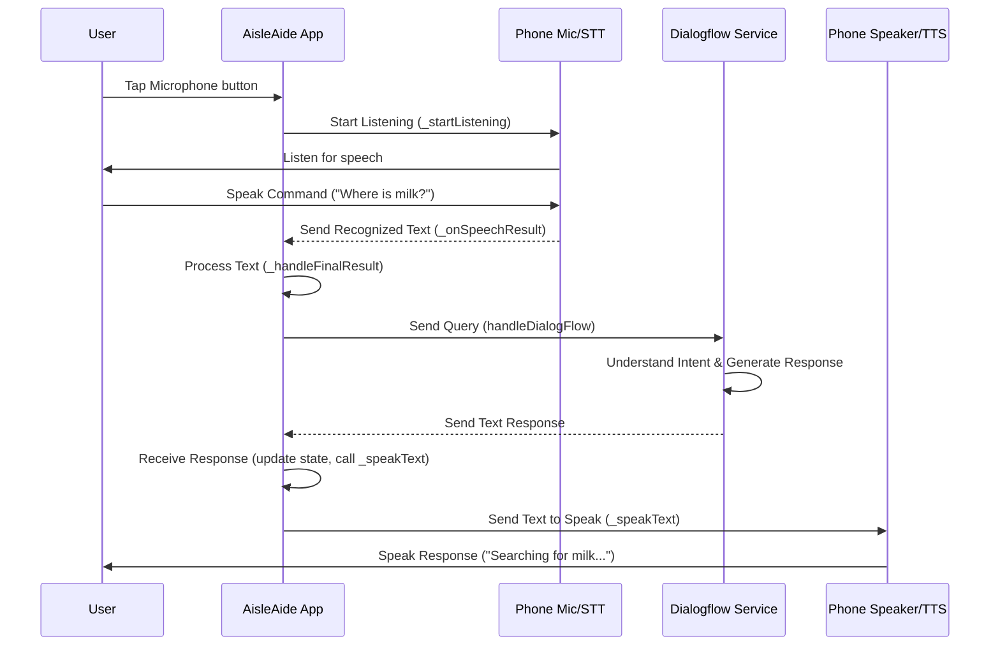

This diagram illustrates the chain of events:
1.  You initiate listening (tap mic).
2.  Your phone captures speech and converts it to text (STT).
3.  The app gets the text and sends it to Dialogflow.
4.  Dialogflow figures out the command's meaning and crafts a text reply.
5.  The app gets the reply and tells the phone to speak it (TTS).
6.  You hear the app's response.

Additionally, some specific spoken phrases (like "home screen" or "cart screen") are checked directly in the `_onSpeechResult` function *before* sending the text to Dialogflow. This allows for quicker navigation commands that don't need complex intent understanding. If one of these navigation phrases is detected, the app immediately triggers the screen navigation using `Navigator.push` and then uses TTS (`_speakText`) to announce that it's navigating.

Here's a simplified look at that navigation logic from `home_screen.dart` or other screens:

```dart
// --- Snippet from lib/Voice_assistant_and_database/home_screen.dart (_onSpeechResult) ---
void _onSpeechResult(SpeechRecognitionResult result) {
  setState(() {
    _wordsSpoken = result.recognizedWords; // Update the recognized text
  });

  if (result.finalResult) {
    // Check for specific navigation commands first
    if (_wordsSpoken.toLowerCase().contains('search products screen')) {
      _navigateToSearchProductsScreen(context); // Navigate to screen
    } else if (_wordsSpoken.toLowerCase().contains('recent shopping')) {
      _navigateToRecentShoppingScreen(context); // Navigate to screen
    }
    // ... similar checks for navigation, camera, cart, profile screens ...
    else {
      // If it's not a navigation command, send it to Dialogflow
      _handleFinalResult(_wordsSpoken);
    }
  }
}

// Example navigation function that speaks confirmation
void _navigateToSearchProductsScreen(BuildContext context) {
  Navigator.of(context).push(MaterialPageRoute(
    builder: (context) => const SearchProductsScreen(),
  ));
  _speakText("You have navigated to the Search Products screen."); // Speak!
}
// ... other navigation functions ...
```

This shows how direct voice commands can bypass Dialogflow for simple actions like navigation, making the app feel more responsive for common tasks.

## Summary

In this chapter, we explored the **Voice Assistant Interaction** feature:

*   It uses **Speech-to-Text (STT)** (`speech_to_text` package) to convert your voice into text.
*   It uses **Dialogflow** (`dialog_flowtter` package) to understand the meaning (intent) of your text commands and generate a response.
*   It uses **Text-to-Speech (TTS)** (`flutter_tts` package) to speak the app's responses back to you.
*   Tapping the microphone button initiates the listening process.
*   When you finish speaking, the recognized text is processed either by checking for specific navigation commands or by sending it to Dialogflow.
*   The response from Dialogflow or the confirmation of a navigation action is then spoken using TTS.

This system provides a powerful and convenient way to interact with AisleAide, allowing for a more natural, hands-free experience while shopping.

This concludes our technical deep dive into the core concepts of the AisleAide project, from its structure and navigation to authentication, in-store positioning, data management, visual scanning, and voice interaction.

---

---

<sub><sup>Generated by [AI Codebase Knowledge Builder](https://github.com/The-Pocket/Tutorial-Codebase-Knowledge).</sup></sub> <sub><sup>**References**: [[1]](https://github.com/Sehandu-Siriwardhana/AisleAide/blob/54a750566e84fa8dc4d576bf67f02843332dd958/aisleaide/lib/Voice_assistant_and_database/camera_screen.dart), [[2]](https://github.com/Sehandu-Siriwardhana/AisleAide/blob/54a750566e84fa8dc4d576bf67f02843332dd958/aisleaide/lib/Voice_assistant_and_database/cart_screen.dart), [[3]](https://github.com/Sehandu-Siriwardhana/AisleAide/blob/54a750566e84fa8dc4d576bf67f02843332dd958/aisleaide/lib/Voice_assistant_and_database/home_screen.dart), [[4]](https://github.com/Sehandu-Siriwardhana/AisleAide/blob/54a750566e84fa8dc4d576bf67f02843332dd958/aisleaide/lib/Voice_assistant_and_database/navigation_screen.dart), [[5]](https://github.com/Sehandu-Siriwardhana/AisleAide/blob/54a750566e84fa8dc4d576bf67f02843332dd958/aisleaide/lib/Voice_assistant_and_database/search_products_screen.dart)</sup></sub>
